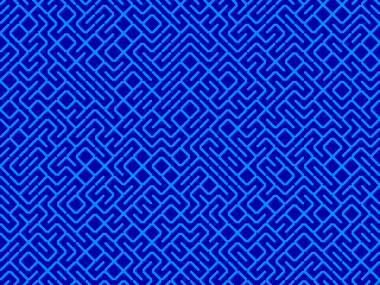
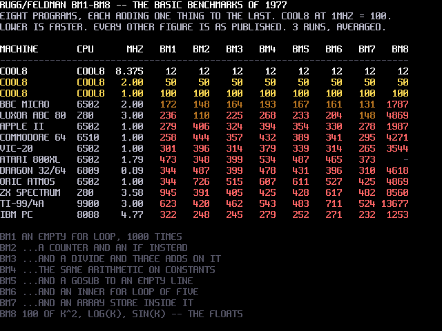
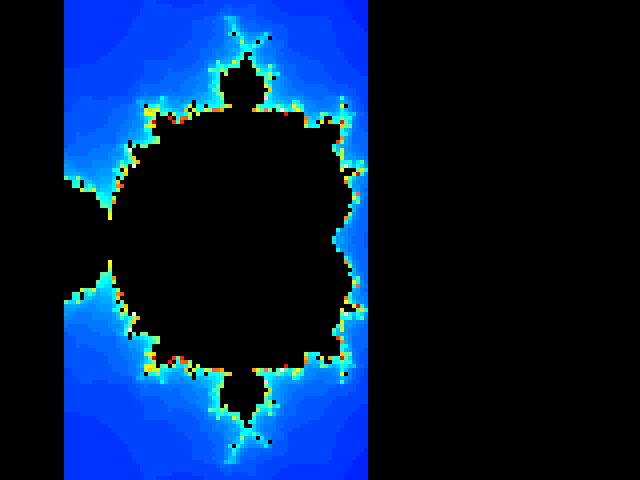
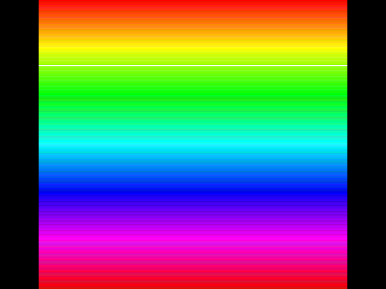

# 14. The demo disc

A COOL8 ships with sixteen volumes. This document owns what is on them,
what a demo is allowed to assume, and how to add one.

```bash
python tools/mkdemos.py --png
```

## 1. The drives

Sixteen volumes, numbered **0 to 15**, 448 KB each, in one 8 MB flash
image ([`tools/cool8disk.py`](../tools/cool8disk.py)). `DRIVE n` selects
one and everything after it — `DIR`, `SAVE`, `LOAD`, `ERA` — works on
that volume until the next `DRIVE`.

| drive | label | holds |
|---|---|---|
| **0** | `SYSTEM` | **the ROM's**: `BOOT.BIN`, and nothing a user should write |
| **1** | `COOL8` | **where a cold machine comes up** — the user's, empty |
| 2–12, 14, 15 | `COOL8` | the user's, formatted and empty |
| **13** | **`DEMOS`** | **the demo disc — what this document is about** |

**Volume 0 is not the user's, and that is the ROM's decision.**
`sw/boot.asm` walks volume 0's directory for `BOOT.BIN`; it is the 4 KB
part a board cannot reflash, so no software may move it. BASIC therefore
comes up on **drive 1** (`fsc_init` in [`sw/fscmd.asm`](../sw/fscmd.asm)),
and an unqualified `SAVE` can never land beside the file the machine
boots from. `FSDRV` was never initialised at all before that — it
inherited the zero the cold-start RAM wipe leaves, which is how volume 0
became the default by accident.

**The layout lives in [`tools/cool8disk.py`](../tools/cool8disk.py)** —
`BOOT_VOL`, `USER_VOL`, `DEMO_VOL` and `make_image` — because three
builders need it (`flash.py`, `mkdemos.py`, `sim/test_boot_basic.py`)
and a layout copied into each is a layout that drifts. `poe disk`
formatted volume 0 alone until the default moved, which would have
booted to a machine whose every `DIR` and `SAVE` failed on a disk that
looked fine.

13 for the demos so a demo disc is somewhere a user will not overwrite
by accident on the first afternoon.

## 2. The sources are the truth, the disc is derived

`demos/*.bas` is what gets reviewed. `tools/mkdemos.py` formats the
volumes, **types each source at the machine**, and lets `SAVE` write it.

**The machine tokenises, and that is the whole design.** A program on
disc is tokenised, and the only thing that knows the token table is
`sw/token.asm`. A host-side tokeniser would be a second implementation
of it and would drift the first time a keyword was added — which is the
trap [AGENTS.md](../AGENTS.md) names first and this project has paid for
a dozen times.

**It no longer types, and that is not a retreat from the above.**
`H.line` writes the text where `ed_read` would have left it and enters
`ed_inject` — `ed_enter` without the screen scrape — so every keyword,
number and quote is still turned into tokens by the machine's own
tokeniser. Nothing on the host knows what `PRINT` is worth.

What it skips is the *keyboard*, which was the cost: a round trip a
character, because the PS/2 queue is sixteen deep and a key is two
scancodes, so a line cannot be delivered in one go and the harness
settles after each. **Ninety seconds to put five demos on a disc,
nearly all of it waiting.** One round trip a line instead: measured
**19.6× on a six-line program**, and the stored program came back
byte-for-byte identical, floats included — which is the gate
`sim/test_run.py` keeps rather than a claim made here.

**A host-side tokeniser was approved and then not written, and the
reason is a number.** The case for one was that a disc could be built
with no VM at all -- worth arguing about when typing five demos cost
ninety seconds. `H.line` made that **2.5 seconds**, and the premise
went with it. What it would still cost has not changed: `snum`'s number
packing, the quoted-text and REM passthrough and the record layout,
reimplemented, with two versions that must agree forever. The rules are
not obvious ones -- a line over eighty characters does not store, `READ`
takes scalar targets only, a five-digit float literal does not survive
the parser, and [D88] floors on the way into an integer -- and every one
is somewhere a second implementation drifts silently. **Reopen it only
if the 2.5 s becomes the problem**, which is a different argument from
the one that was approved.

**The keyboard is still proven, deliberately.** Typing every character
was the only thing exercising the real driver end to end — the PS/2
ISR, `sw/keymap.asm`, the editor's per-key handling — and it did so as
a *side effect* of building a disc. A side effect can vanish without
anyone noticing, so it is a named case in `sim/test_run.py` now.

So a demo is edited as text, rebuilt, and never patched as a binary.

## 3. What a demo may assume

**Nothing that needs the toolchain.** Demos are built and run on the VM
(`python tools/mkdemos.py --png` renders a frame), because a question
about software is a question for the fast machine — the RTL is for
questions about the hardware.

**BASIC only.** A demo that needs machine code should ship it as a PRG
and reach it with `SYS "NAME.BIN"` ([D87]), so the BASIC stays readable.

**The palette is in the bitstream** ([D77], [D79]) — sixteen banks of
sixteen, published palettes, live from reset. A demo does not seed a
palette and must not assume it may scribble on one without saying so.

## 4. The demos

### `MAZE` — after the C64 one-liner

```
10 PRINT CHR$(205.5+RND(1)); : GOTO 10
```

is the most famous BASIC program written, and has a
[book](https://mitpress.mit.edu/9780262526746/10-print-chr205-5rnd1-goto-10/)
about it. It works because PETSCII 205 and 206 are the two diagonals,
and `RND` picks between them.



**Forty columns, because the cell has to be square.** Mode 0's 80×30
cells are 8 wide by 16 high, so a diagonal drawn in one is not at 45°
and the maze comes out sheared. Forty columns makes the cell 16×16.

**It is tile mode, and that is not a preference.** The text version was
written first, in mode 1, drawing CP437's `/` and `\` at 47 and 92 with
`47 + 45*RND(2)` standing in for `205.5 + RND(1)`. It was wrong on the
screen: **those glyphs have side bearing.** They stop short of the cell
edge, so every join in the maze is broken and the picture is a field of
dashes. The text font is 4 KB of EBR read by the hardware — ROM, not
redefinable — so there is no fixing it in mode 1. Mode 2 is the same
40×30 geometry with the pattern in RAM, which is the whole difference.

**The tile is C64 screen code 77, pixel for pixel.** Transcribed from
the character ROM rather than drawn by hand, and drawing it by hand got
it wrong twice: the real glyph is two and three pixels wide, not one,
and it reaches both corners. Code 78 is its exact horizontal mirror —
checked, not assumed — so **attribute bit 6 draws the other diagonal and
one 32-byte tile serves both**, which is why the `DATA` is four lines
and not eight.

**The scroll is the hardware's, and nothing moves in memory.** The tile
map is a ring 32 rows tall with 30 shown (§5.5), so `VID_SCY` steps the
eight pixels inside a tile and one stride onto `VID_BASE` steps the row
— wrapped back into the ring with a compare and subtract, because
software wraps the base and the hardware only wraps its own row pointer
within it. The demo draws the row it is *about to need* and then scrolls
onto it. **A fine scroll makes the window touch 31 rows, not 30**, so of
a 32-row ring exactly one row is off screen and only that one is safe to
draw into: the fill is 32, and 31 would build every new row in the
part-shown row along the bottom edge, in view.

`MODE 2` leaves `VID_BASE` at 0 and `VID_STRIDE` at 128 — asked, not
assumed, and the demo reads the stride rather than writing 128 down.

**It is paced on `VID_IRQ`'s vblank flag** — write 1 to clear, then wait
for it, which is one frame unambiguously. `VID_RASTER` cannot do this:
it is bits 7:0 of a line count that runs past 255, so the same value
comes round twice a frame and BASIC cannot tell which. **The coarse step
goes with fine step 0**, because `VID_BASE` and the tile row offset are
both sampled at frame start; pair the base with step 7 instead and one
frame shows a row and seven pixels at once and the next comes back,
which reads as a shudder.

**The palette is the C64's, copied.** Bank 0 is overwritten entry for
entry from a `DATA` table of RGB444 pairs, so 6 is `#0000AA` and 14 is
`#0088FF` — the same numbers a C64 program means when it says 6 and 14
([`tools/palette.py`](../tools/palette.py) bank 10 is the same set, kept
in the C64's own index order for the same reason). The tile is drawn in
those two indices directly: paper 6, ink 14.

### `RAINBOW` — a bouncing line with a fifteen-line trail


Two endpoints bounce independently around mode 4's 320×240, and a ring
buffer of fifteen holds the older lines so the trail can be erased
oldest-first. The colour is the ring slot, so the trail walks the whole
palette as it goes.

**It is a demonstration of `VSYNC` more than of `LINE`.** The loop draws
one line, erases one line and waits for the frame — so it runs at
exactly 60 Hz because the hardware says when, not because the work
happens to take that long.

**`PALETTE` was a statement once and is not any more**;
[13-basic.md](13-basic.md) lists what went and what replaces it. This demo was
written before it went, and porting it was the whole of the change:
`PALETTE i, v` is `PAL_IDX` then `PAL_DATA` twice, **high byte first**,
which is what the `DATA` pairs are. Everything else it uses — `CLG`,
`LINE`, `VSYNC`, `DO`/`LOOP`, `DIM` and arrays — still works unchanged.

### `BENCH` — the Rugg/Feldman benchmarks



BM1–BM8 as published (Kilobaud, June 1977; BM8 is John Coll's, *Personal
Computer World*, February 1978), then a table against the machines they
were written for. **The listings inside the timing are unchanged** — the
repeat loop is outside them, and `IF K<1000 THEN GOTO 500` is the one
edit, which this BASIC requires.

**It reports an index, not seconds: COOL8 at 1 MHz is 100**, and lower
is faster. Seconds invite a comparison the clocks do not support — this
machine runs at 8.375 MHz against a table of 1–2 MHz ones — so the
baseline is COOL8 scaled to 1 MHz and every column is a ratio against
it, in whole numbers. `CPU` and `MHZ` are their own columns, because the
clock is most of the answer and burying it in the name hides that.

**BM5–BM7 used to be the weak columns, and the benchmark is what found
out why.** Against a C64 they sat at 141, 149 and 164 while the pure
arithmetic loops were at 360 and 436 — the three that call a subroutine
scoring worst is not a coincidence, it is a signature. The cause was
`prg_find`'s memo having one slot: the inner loop is `GOSUB 2` then
`GOTO <head>`, two targets at opposite ends of the program, so they
evicted each other every pass and every jump walked from `PROGBOT`
again. A second slot ([`sw/prog.asm`](../sw/prog.asm)) cost 48 bytes and
bought **2.6× on BM5, 2.3× on BM6, 1.8× on BM7**; the C64 columns are
now 360, 346 and 299, in line with the rest. **BM1–BM4 came back
byte-identical**, which is the control that says nothing else moved.

**One significant figure on these, because the demo is timed in
frames.** Three runs are averaged against a 16.7 ms tick, and two
consecutive builds of the same binary gave BM5 as 360 and 386 — about
7 % apart. The isolated measurement below is the tighter one, and the
`poe bench` table in [13-basic.md](13-basic.md) is tighter still because
it counts cycles rather than frames.

Isolated, the loop is 104 frames against 31 for the same loop with the
`GOSUB` removed; after the second slot it is 39. The call itself was
never expensive — 8 frames — and the other 65 were the eviction.

**`4.1875` does not survive the parser** — five significant digits
against a float that carries about four, and the whole row came out
negative. The 2 MHz row is `8.375/2`, which is the clock the machine
actually runs at and four digits.

**Ten of the figures come from one table** and are comparable with each
other. The **IBM PC** (8088 at 4.77 MHz) is *MikroDatorn*'s 1982 run of
the same benchmarks, noted on screen as a different source — its VIC-20
row matches the other table exactly, which is the reason for trusting it
beside them. MSX, Amstrad/Schneider CPC and TRS-80 are in neither and
are left out rather than filled in from a third stopwatch.

**What it took to write says more about the BASIC than the times do:**

- **Variable names are one letter.** `SL` and `SM` are both `S`; `RP` is
  `R`, which was the repeat count, so the loop overwrote its own bound.
- **The suffix picks the type and none means integer** (§`DIM`). `DIM
  T(8)` truncated every measurement to whole seconds; it is `T#(8)`.
  `V/10` is integer division for the same reason — `V*0.1` is not.
- **`READ` will not take a float from `DATA`**, so the published figures
  are stored as tenths.
- **A 24-bit frame count does not fit the float** — four significant
  digits — so the timer differences the two low bytes, each exact, which
  still spans eighteen minutes.
- **BM1 finishes in under one frame.** A thousand `FOR` iterations is
  ~12 ms against a 16.7 ms tick, so each benchmark runs three times and
  is averaged.
- **A source line over 80 characters is not a stored line.** The header
  row was 87 with `1040 PRINT "` on the front, so the editor never kept
  it and the table printed with no column names — silently, because a
  line that does not store cannot fail at run time. Both header rows are
  split now.
- **`4.1875` does not survive the parser** — five significant digits
  against about four — and the row it scaled came out *negative*. The
  2 MHz row is `8.375/2`.

### `MANDEL` — the set, in fixed point



Mode 6, the only mode that sees all 256 palette entries at once, with a
gradient built as four ramps and entry 0 forced black for the interior.

**It is integer arithmetic, and that is the whole reason it finishes.**
A float operation on this machine costs about five times an integer one
(BM3 in `BENCH` is integer — that is easy to misread), so the iteration
runs in **Q6 fixed point**: 64 units to 1.0, which is the largest scale
whose products still fit a signed 16-bit word. `zx*zy` peaks at 16,384;
at Q7 it would reach 65,536 and overflow.

Two details that are not optional:

- **`A*B/32`, not `2*A*B/64`.** Same value; the doubled form peaks at
  32,768 and overflows a signed word by exactly one.
- **The escape is tested *before* squaring.** A value that has just
  escaped can be four times the bound, and squaring it overflows — so
  the test is `|zx|>2 or |zy|>2` and the squares are skipped on the way
  out. That is a square escape boundary rather than a circular one,
  which is the standard fixed-point trade.

**Mariani-Silver does the rest.** The set is connected, so a rectangle
whose border is one colour is that colour throughout: fill it and
compute nothing inside. Filling is one `POKE` a pixel against sixty-four
iterations of arithmetic, so *not* computing a region is worth hundreds
of times its area. The stack is four arrays and an index rather than
recursion — no `CALL` frame per rectangle, no 32-deep limit — and the
contour bands in the picture are those rectangles.

**The symmetric pixel is written at the same time**, not in a second
pass: the value is already in hand, so the mirror costs four more
`POKE`s and saves reading 30,720 bytes back.

**The flat band on the left was the left edge, not the zoom, and it
took two goes to say so.** Every column with x < −2 escapes on the
*first* iteration — `A` is `X` after one pass, and the test fires at
`A < −128` — so it comes out one colour, and a run of such columns is a
flat vertical band. The first attempt narrowed the *step* (2 units to
1.5), which took the band from 25% to 8.6% and looked like progress:
thinner columns, so fewer of them outside the set. But the left edge
stayed at −2.25, a quarter-unit left of the set's leftmost point, so
eleven columns of 128 still escaped at once. **Narrowing a view does
not move its edge.**

The edge is −2.00 now and the step is `I*5/4`, which is 2.47 across by
2.34 down: **no column escapes on the first iteration**, and the set
fills 91% of the width instead of 76%. Both axes use the same Q6 step,
so the pixels stay square. The colour count went 50 to 53 — finer
sampling finds more escape counts.

**Why it is not 256 colours.** The distinct colour count is bounded by
the iteration cap, not by the palette: 64 iterations can produce at most
64 values. Raising the cap to 128 gained one — this view simply does not
contain many high escape counts. More colour needs a zoom or continuous
colouring, not a bigger number.

### `WAVE` — a sine sweep with a gradient trail



A full-width horizontal line follows a sine down mode 6's 256×240 and
leaves a sixty-four-line trail behind it: newest drawn white, the one
before it aged into the gradient, the oldest erased. Sixty-four
positions in a ring, which is `RAINBOW`'s trick at four times the
length.

**A horizontal span really is cheaper than a vertical one, and the
reason is in the hardware.** `PIX_DATA` auto-increments X (§5.7), so a
horizontal run is one store a pixel while a vertical one has to rewrite
X and Y for every pixel — three. Measured from BASIC, twenty spans of
192 pixels: **27 frames horizontal against 88 vertical, 3.3×**. `HLINE`
was a keyword once and this is what replaced it.

**And it does not matter, because hand-poking is the wrong primitive.**
The first version drew its spans that way — 512 `POKE`s a frame — and
ran at **four iterations a second**. The profile says why: `h_poke` was
**3.9 %** of the clocks and `prim`/`stmt`/`erel`/`eval` were **64 %**.
BASIC was not storing pixels, it was *parsing statements about* storing
pixels, and the direction of the span is noise beside that. `LINE` is
Bresenham in machine code, one statement for the whole span: the same
512 pixels a frame, **60 Hz, `VSYNC`-paced**. The lesson generalises —
in this BASIC the cost of a loop is the statements in it, so the win is
never a cheaper store, it is a primitive that stores without being
asked again.

**Two counters stepping integers mod 256 are phase-locked, always.**
The second oscillator stepped 3 against the first's 1, which makes
`B = 3A` — not a second voice but a fixed harmonic, and its peaks
cancelled the fundamental's. The wave reached **87 of 240 rows** and
repeated exactly every 256 frames. The fix is a modulus, not a step:
the amplitude's counter wraps at **251, coprime to 256**, so the pair
repeats every `lcm(251, 256)` = 64,256 frames — eighteen minutes.
Coverage then climbs 107 → 191 rows over the first minute and the
picture never settles.

**Palette entry 0 is the border.** Starting the ramp at 0 turned the
whole overscan electric blue, which is not a bug in the demo so much as
a fact about the video path worth writing down: entry 0 is the
background *and* the frame around it. The ramp is entries 1–247, 0 is
the dark ground, 255 is the leading line.

**This demo overwrites all 256 palette entries**, which §3 says a demo
may not do quietly. The ramp is built at run time rather than typed as
`DATA`: `#10F` electric blue through violet to `#F6B` hot pink,
mirrored at 124 so the cycle has no seam.

**One colour per row, which is the most the mode can show.** Mode 6 is
240 rows, so 240 is the ceiling on colours visible at once -- 256 is not
reachable no matter what the palette holds, because a colour has to be
*on* a row to be seen. The ramp is 240 entries and the sweep covers
rows 1-239, so no two rows share a colour: **239 measured on screen, at
every sample, with zero background rows**.

**Two different black gaps, and only one was a bug.** The mirror was
`240-S`, so the table spanned rows 1-239 and **row 0 was never painted
at all** -- a permanent black line along the top, by construction. It is
`239-S` now and every row of 0-239 is covered.

The other was the head being drawn first and the rows behind it filled
one `LINE` at a time, so a row showed the background until its turn and
the raster could scan the span mid-fill. Slowing the sweep only shrank
that window, and **slowing it made the colours worse** -- 12 s a sweep
measured 162 distinct where 4 s measured 224.

**The colour comes from the row now, not from a counter, and that fixed
both.** A counter cannot be made to work here. Each row is painted twice
a period, once going down and once coming back, so the counter advances
478 times across 240 entries; the last-paint values on screen span ~478
and collapse into 240, and about a third of the rows collide at any
speed. Row-locked, `LINE 0,I,255,I,I+1`, the map is a bijection by
construction: **240 distinct, always**, measured every half second over
30 s.

The same change removed the gaps outright, which was the part worth
having. Repainting a row to the colour it already holds is invisible, so
a half-finished fill cannot be seen -- there is nothing to expose. Only
two rows change per frame: the head, and the one it left. The old head
is cleared **before** the new one is drawn, so the worst a torn frame
shows is no white line for one frame, never two. Measured over 30 s: 0
black rows inside the band, never more than one white row.

What it costs is the cycling trail. The trail is a fixed rainbow the
wave reveals rather than a gradient that drifts, because those two
things are the same variable and cannot both be had at 240 rows and 240
entries.

**One rotation of the spectrum, and the arithmetic of where the slack
goes.** 240 distinct colours a click apart is 240 clicks of movement,
and **one turn of the hue circle supplies only 90** -- six edges of
fifteen in 12-bit RGB. The other 150 have to come from somewhere that
is not hue, and the whole design question is where they land.

Spent as a brightness ripple they are bands: the best a ripple managed
was 222 distinct at thirty visible pulses. Spent as three rotations
they are three passes of the same colours, which is what the ramp did
before, and its blue-dominant entries -- blue carries 0.114 of
perceived luminance against green's 0.587 -- came out near-black three
times over, reading as dark rules spread evenly down the screen.

They are spent here as a deviation from the ideal circle at each entry:
walk the hue circle and take the best unused colour a click or two from
the last. **What "best" means is the whole fix.** Nearest-by-distance
took inward neighbours as readily as outward, and a red dropped 15->14
costs 0.299 of perceived luminance where a green costs 0.587 -- so 40
rows sat visibly darker than the two beside them, spaced at the 240/90
beat. Those were the shadow bands.

Ranking by luminance alone is worse the other way: it wanders 2.71
clicks off the circle and the ramp desaturates. The cost is
`4*luminance_error + hue_error`, and 4 is the measured knee -- **0 rows
darker than their neighbours, mean deviation 1.18 of a click, no step
above two**, checked on the machine's own scanout and not on a
screenshot.

What cannot be fixed: **116 of the 239 neighbouring pairs differ by a
single click**, which is distinct in the palette and identical to the
eye. 240 rows over a circle with 90 colours in it leaves no other
outcome.

The blue quarter is still the darkest part of the ramp, luminance 1.6
against the yellows' 13.4. That is not an artefact to be removed -- it
is what a saturated spectrum looks like, and holding luminance flat
instead costs the saturation that makes it a rainbow at all.

The ends need not meet. The colour is the row, not a cycling counter,
so entry 0 and entry 239 are opposite edges of the screen and never
touch.

**Earlier ramps grouped rows in twos and threes, and the arithmetic
says why.** A smooth ramp moves one channel by one at a time, so the
distinct colours it can show equals the steps it takes through 12-bit
RGB. A hue circle at full saturation is six segments of fifteen: **90
steps and no more**. Spread over 247 entries that is 2.7 entries a
colour, and the eye sees bands of two and three rows. The first ramp
here was worse -- an L1 path of 24, so 23 colours and 224 duplicates.

**So the ramp is three hue rotations against one brightness breath**,
which is long enough to visit 240 distinct colours. Two rotations, or a
darker floor than `v = 8`, collapse different hues onto the same 4-bit
RGB and the count falls short -- that is measured, not chosen. 172 of
the 240 steps move a single channel by one; 54 move two and 14 move
three, which is the price of insisting on 240 distinct in a 4096-colour
space. The loop closes on a single step, so `E` wrapping shows no seam.

**The table is `DATA`, computed when this file was written.** 181
values for the first quarter, mirrored three ways at run time —
`S(360-i)`, `240-S(360+i)`, `240-S(720-i)` — which is integer work and
therefore safe. It is `DATA` rather than a `SIN` loop because **a float
assigned to an integer variable is not converted on this machine**
([13-basic.md §8](13-basic.md)): `S(I) = 120 + 110*SIN(...)` stores
−6654 where 230 belongs, silently, while `PRINT` of the same expression
is correct. This demo shipped once with a sine table that was not a
sine and looked plausible enough on screen that only counting the rows
caught it. Note also that `READ` takes scalar targets only, so it is
`READ V` then `S(I) = V`; `READ S(I)` is `?INDEX`.

## 5. Adding one

1. Write `demos/name.bas`. Keep it BASIC, keep it under 80 characters a
   line (the editor's logical line), and say in a `REM` what it is and
   where it came from.
2. `poe demos` — every demo is typed in, saved, run and shot.
3. Look at the picture. `docs/img/demo-<name>.png`.
4. Add a section here saying what it demonstrates about *this* machine,
   not just what it draws.
