# 14. The demo disc

A COOL8 ships with sixteen volumes. This document owns what is on them,
what a demo is allowed to assume, and how to add one.

```bash
python tools/mkdemos.py --png
```

## 1. The drives

Sixteen volumes, numbered **0 to 15**, 448 KB each, in one 8 MB flash
image ([`tools/cool8disk.py`](../tools/cool8disk.py)). `DRIVE n` selects
one and everything after it — `DIR`, `SAVE`, `LOAD`, `ERA` — works on
that volume until the next `DRIVE`.

| drive | label | holds |
|---|---|---|
| **0** | `SYSTEM` | **the ROM's**: `BOOT.BIN`, and nothing a user should write |
| **1** | `COOL8` | **where a cold machine comes up** — the user's, empty |
| 2–9 | `COOL8` | the user's, formatted and empty |
| **10** | **`PICTURES`** | **the picture drive**: the `.PIC` files SLIDES shows, a screen of mode 6 each, and beside each the `.RPL` that changes its palette row by row -- §4, `SLIDES` |
| **11** | **`ACTION`** | **the CoolAction! disc**: every `demos/*.act`, compiled, as a bare `.BIN` — the Demos menu's twin |
| **12** | `BAPPLE` | Bad Apple's stream, capped to this one drive — §4 |
| **13** | **`DEMOS`** | **the demo disc**: everything written in BASIC, games included |
| **14** | `SOFTWARE` | the machine-code systems — the four Infocom games and the p-System's loader — each a `.BIN` behind a `.BAS` stub |
| 15 | `PASCAL` | the p-System's own volume: not a menu, reached through `PASCAL` on 14 |

**Three of those are menus, and a menu is a drive.** The emulators —
the web page and the window — read the catalogue `tools/cool8disk.py`
writes, group it by the volume an entry came from, and title each
group from `cool8disk.MENUS`: **Demos** (13), **Software** (14),
**CoolAction** (11). Nothing in either emulator names a program or
knows the disc format; `catalogue()` gained a `kind` per entry so the
launcher knows which of two things to type — `LOAD` and `RUN` for a
`.BAS`, `SYS "NAME.BIN"` for a `.BIN` — and that is the whole of what
they were taught ([D99](01-decisions.md#d99--three-menus-and-a-menu-is-a-drive)).

**The split is by language, not by genre.** If it is written in BASIC
it is a Demo, and TAIPAN and the two COOLTRIS being games does not
move them. Software is what the machine runs natively — the Z-Machine
and the p-System — reached through a small BASIC stub that sets the
drive and `SYS`es into the interpreter; the stub is the menu entry and
the `.BIN` beside it is not listed twice. CoolAction is the compiled
`.BIN` demos, no stub at all. RAINBOW and the other ports therefore
exist twice under one name, on 13 in BASIC and on 11 compiled, and
that is the point: the two menus are how the interpreter and the
compiler get compared on the same picture. COBRA is on both as well,
but as two programs: the compiled one tumbles, every frame computed
([D105](01-decisions.md)).

| menu | drive | programs |
|---|---|---|
| **Demos** | 13 | MAZE, RAINBOW, WAVE, PLASMA, INTRO, BOING, TRIANGLES, MANDEL, COBRA, SYNTH, BENCH, MINIBNCH, BAPPLE, TAIPAN, COOLTRS1, COOLTRS2 |
| **Software** | 14 | HHGG, ZORK1, PLANET, LGOP, PASCAL |
| **CoolAction** | 11 | RAINBOW, TRIANGLE, MAZE, PLASMA, WAVE, MANDEL, SYNTH, INTRO, PRIMES — the compiled twins, §4 — COBRA, which shares only its ship and its name with the BASIC's, COBRA2, its camera and sky, and MSCOOLMN, ARKANOID, KEYTEST and SLIDES, which have no BASIC |

**Volume 0 is not the user's, and that is the ROM's decision.**
`sw/boot.asm` walks volume 0's directory for `BOOT.BIN`; it is the 4 KB
part a board cannot reflash, so no software may move it. BASIC therefore
comes up on **drive 1** (`fsc_init` in [`sw/fscmd.asm`](../sw/fscmd.asm)),
and an unqualified `SAVE` can never land beside the file the machine
boots from. `FSDRV` was never initialised at all before that — it
inherited the zero the cold-start RAM wipe leaves, which is how volume 0
became the default by accident.

**The layout lives in [`tools/cool8disk.py`](../tools/cool8disk.py)** —
`BOOT_VOL`, `USER_VOL`, `DEMO_VOL` and `make_image` — because three
builders need it (`flash.py`, `mkdemos.py`, `sim/test_boot_basic.py`)
and a layout copied into each is a layout that drifts. `poe disk`
formatted volume 0 alone until the default moved, which would have
booted to a machine whose every `DIR` and `SAVE` failed on a disk that
looked fine.

13 for the demos so a demo disc is somewhere a user will not overwrite
by accident on the first afternoon. `CLAIMED` in the same file is the
set of volumes something owns — 0, 1, 10, 11, 13, 14, 15 — and Bad Apple's
planner may not put a chunk on one of them (§4, `BAPPLE`).

## 2. The sources are the truth, the disc is derived

`demos/*.bas` is what gets reviewed. `tools/mkdemos.py` formats the
volumes, **types each source at the machine**, and lets `SAVE` write it.

**The machine tokenises, and that is the whole design.** A program on
disc is tokenised, and the only thing that knows the token table is
`sw/token.asm`. A host-side tokeniser would be a second implementation
of it and would drift the first time a keyword was added — which is the
trap [AGENTS.md](../AGENTS.md) names first and this project has paid for
a dozen times.

**It no longer types, and that is not a retreat from the above.**
`H.line` writes the text where `ed_read` would have left it and enters
`ed_inject` — `ed_enter` without the screen scrape — so every keyword,
number and quote is still turned into tokens by the machine's own
tokeniser. Nothing on the host knows what `PRINT` is worth.

What it skips is the *keyboard*, which was the cost: a round trip a
character, because the PS/2 queue is sixteen deep and a key is two
scancodes, so a line cannot be delivered in one go and the harness
settles after each. **Ninety seconds to put five demos on a disc,
nearly all of it waiting.** One round trip a line instead: measured
**19.6× on a six-line program**, and the stored program came back
byte-for-byte identical, floats included — which is the gate
`sim/test_run.py` keeps rather than a claim made here.

**A host-side tokeniser was approved and then not written, and the
reason is a number.** The case for one was that a disc could be built
with no VM at all -- worth arguing about when typing five demos cost
ninety seconds. `H.line` made that **2.5 seconds**, and the premise
went with it. What it would still cost has not changed: `snum`'s number
packing, the quoted-text and REM passthrough and the record layout,
reimplemented, with two versions that must agree forever. The rules are
not obvious ones -- a line over eighty characters does not store, `READ`
takes scalar targets only, a five-digit float literal does not survive
the parser, and [D88] floors on the way into an integer -- and every one
is somewhere a second implementation drifts silently. **Reopen it only
if the 2.5 s becomes the problem**, which is a different argument from
the one that was approved.

**The keyboard is still proven, deliberately.** Typing every character
was the only thing exercising the real driver end to end — the PS/2
ISR, `sw/keymap.asm`, the editor's per-key handling — and it did so as
a *side effect* of building a disc. A side effect can vanish without
anyone noticing, so it is a named case in `sim/test_run.py` now.

So a demo is edited as text, rebuilt, and never patched as a binary.

## 3. What a demo may assume

**Nothing that needs the toolchain.** Demos are built and run on the VM
(`python tools/mkdemos.py --png` renders a frame), because a question
about software is a question for the fast machine — the RTL is for
questions about the hardware.

**BASIC only.** A demo that needs machine code should ship it as a PRG
and reach it with `SYS "NAME.BIN"` ([D87]), so the BASIC stays readable.

**The palette is in the bitstream** ([D77], [D79]) — sixteen banks of
sixteen, published palettes, live from reset. A demo does not seed a
palette and must not assume it may scribble on one without saying so.

## 4. The demos

### `MAZE` — after the C64 one-liner

```
10 PRINT CHR$(205.5+RND(1)); : GOTO 10
```

is the most famous BASIC program written, and has a
[book](https://mitpress.mit.edu/9780262526746/10-print-chr205-5rnd1-goto-10/)
about it. It works because PETSCII 205 and 206 are the two diagonals,
and `RND` picks between them.


**Forty columns, because the cell has to be square.** Mode 0's 80×30
cells are 8 wide by 16 high, so a diagonal drawn in one is not at 45°
and the maze comes out sheared. Forty columns makes the cell 16×16.

**It is tile mode, and that is not a preference.** The text version was
written first, in mode 1, drawing CP437's `/` and `\` at 47 and 92 with
`47 + 45*RND(2)` standing in for `205.5 + RND(1)`. It was wrong on the
screen: **those glyphs have side bearing.** They stop short of the cell
edge, so every join in the maze is broken and the picture is a field of
dashes. The text font is 4 KB of EBR read by the hardware — ROM, not
redefinable — so there is no fixing it in mode 1. Mode 2 is the same
40×30 geometry with the pattern in RAM, which is the whole difference.

**The tile is C64 screen code 77, pixel for pixel.** Transcribed from
the character ROM rather than drawn by hand, and drawing it by hand got
it wrong twice: the real glyph is two and three pixels wide, not one,
and it reaches both corners. Code 78 is its exact horizontal mirror —
checked, not assumed — so **attribute bit 6 draws the other diagonal and
one 32-byte tile serves both**, which is why the `DATA` is four lines
and not eight.

**The scroll is the hardware's, and nothing moves in memory.** The tile
map is a ring 32 rows tall with 30 shown (§5.5), so `VID_SCY` steps the
eight pixels inside a tile and one stride onto `VID_BASE` steps the row
— wrapped back into the ring with a compare and subtract, because
software wraps the base and the hardware only wraps its own row pointer
within it. The demo draws the row it is *about to need* and then scrolls
onto it. **A fine scroll makes the window touch 31 rows, not 30**, so of
a 32-row ring exactly one row is off screen and only that one is safe to
draw into: the fill is 32, and 31 would build every new row in the
part-shown row along the bottom edge, in view.

`MODE 2` leaves `VID_BASE` at 0 and `VID_STRIDE` at 128 — asked, not
assumed, and the demo reads the stride rather than writing 128 down.

**It is paced on `VID_IRQ`'s vblank flag** — write 1 to clear, then wait
for it, which is one frame unambiguously. `VID_RASTER` cannot do this:
it is bits 7:0 of a line count that runs past 255, so the same value
comes round twice a frame and BASIC cannot tell which. **The coarse step
goes with fine step 0**, because `VID_BASE` and the tile row offset are
both sampled at frame start; pair the base with step 7 instead and one
frame shows a row and seven pixels at once and the next comes back,
which reads as a shudder.

**The palette is the C64's, copied.** Bank 0 is overwritten entry for
entry from a `DATA` table of RGB444 pairs, so 6 is `#0000AA` and 14 is
`#0088FF` — the same numbers a C64 program means when it says 6 and 14
([`tools/palette.py`](../tools/palette.py) bank 10 is the same set, kept
in the C64's own index order for the same reason). The tile is drawn in
those two indices directly: paper 6, ink 14.

### `RAINBOW` — a bouncing line with a fifteen-line trail


Two endpoints bounce independently around mode 4's 320×240, and a ring
buffer of fifteen holds the older lines so the trail can be erased
oldest-first. The colour is the ring slot, so the trail walks the whole
palette as it goes.

**It is a demonstration of `VSYNC` more than of `LINE`.** The loop draws
one line, erases one line and waits for the frame — so it runs at
exactly 60 Hz because the hardware says when, not because the work
happens to take that long.

**`PALETTE` was a statement once and is not any more**;
[13-basic.md](13-basic.md) lists what went and what replaces it. This demo was
written before it went, and porting it was the whole of the change:
`PALETTE i, v` is `PAL_IDX` then `PAL_DATA` twice, **high byte first**,
which is what the `DATA` pairs are. Everything else it uses — `CLG`,
`LINE`, `VSYNC`, `DO`/`LOOP`, `DIM` and arrays — still works unchanged.

### `BENCH` — the Rugg/Feldman benchmarks


BM1–BM8 as published (Kilobaud, June 1977; BM8 is John Coll's, *Personal
Computer World*, February 1978), then a table against the machines they
were written for. **The listings inside the timing are unchanged** — the
repeat loop is outside them, and `IF K<1000 THEN GOTO 500` is the one
edit, which this BASIC requires.

**It reports an index, not seconds: COOL8 at 1 MHz is 100**, and lower
is faster. Seconds invite a comparison the clocks do not support — this
machine runs at 8.375 MHz against a table of 1–2 MHz ones — so the
baseline is COOL8 scaled to 1 MHz and every column is a ratio against
it, in whole numbers. `CPU` and `MHZ` are their own columns, because the
clock is most of the answer and burying it in the name hides that.

**BM5–BM7 used to be the weak columns, and the benchmark is what found
out why.** Against a C64 they sat at 141, 149 and 164 while the pure
arithmetic loops were at 360 and 436 — the three that call a subroutine
scoring worst is not a coincidence, it is a signature. The cause was
`prg_find`'s memo having one slot: the inner loop is `GOSUB 2` then
`GOTO <head>`, two targets at opposite ends of the program, so they
evicted each other every pass and every jump walked from `PROGBOT`
again. A second slot ([`sw/prog.asm`](../sw/prog.asm)) cost 48 bytes and
bought **2.6× on BM5, 2.3× on BM6, 1.8× on BM7**; the C64 columns are
now 360, 346 and 299, in line with the rest. **BM1–BM4 came back
byte-identical**, which is the control that says nothing else moved.

**One significant figure on these, because the demo is timed in
frames.** Three runs are averaged against a 16.7 ms tick, and two
consecutive builds of the same binary gave BM5 as 360 and 386 — about
7 % apart. The isolated measurement below is the tighter one, and the
`poe bench` table in [13-basic.md](13-basic.md) is tighter still because
it counts cycles rather than frames.

Isolated, the loop is 104 frames against 31 for the same loop with the
`GOSUB` removed; after the second slot it is 39. The call itself was
never expensive — 8 frames — and the other 65 were the eviction.

**`4.1875` does not survive the parser** — five significant digits
against a float that carries about four, and the whole row came out
negative. The 2 MHz row is `8.375/2`, which is the clock the machine
actually runs at and four digits.

**Ten of the figures come from one table** and are comparable with each
other. The **IBM PC** (8088 at 4.77 MHz) is *MikroDatorn*'s 1982 run of
the same benchmarks, noted on screen as a different source — its VIC-20
row matches the other table exactly, which is the reason for trusting it
beside them. MSX, Amstrad/Schneider CPC and TRS-80 are in neither and
are left out rather than filled in from a third stopwatch.

**What it took to write says more about the BASIC than the times do:**

- **Variable names are one letter.** `SL` and `SM` are both `S`; `RP` is
  `R`, which was the repeat count, so the loop overwrote its own bound.
- **The suffix picks the type and none means integer** (§`DIM`). `DIM
  T(8)` truncated every measurement to whole seconds; it is `T#(8)`.
  `V/10` is integer division for the same reason — `V*0.1` is not.
- **`READ` will not take a float from `DATA`**, so the published figures
  are stored as tenths.
- **A 24-bit frame count does not fit the float** — four significant
  digits — so the timer differences the two low bytes, each exact, which
  still spans eighteen minutes.
- **BM1 finishes in under one frame.** A thousand `FOR` iterations is
  ~12 ms against a 16.7 ms tick, so each benchmark runs three times and
  is averaged.
- **A source line over 80 characters is not a stored line.** The header
  row was 87 with `1040 PRINT "` on the front, so the editor never kept
  it and the table printed with no column names — silently, because a
  line that does not store cannot fail at run time. Both header rows are
  split now.
- **`4.1875` does not survive the parser** — five significant digits
  against about four — and the row it scaled came out *negative*. The
  2 MHz row is `8.375/2`.

### `MANDEL` — the set, in fixed point


Mode 6, the only mode that sees all 256 palette entries at once, with a
gradient built as four ramps and entry 0 forced black for the interior.

**It is integer arithmetic, and that is the whole reason it finishes.**
A float operation on this machine costs about five times an integer one
(BM3 in `BENCH` is integer — that is easy to misread), so the iteration
runs in **Q6 fixed point**: 64 units to 1.0, which is the largest scale
whose products still fit a signed 16-bit word. `zx*zy` peaks at 16,384;
at Q7 it would reach 65,536 and overflow.

Two details that are not optional:

- **`A*B/32`, not `2*A*B/64`.** Same value; the doubled form peaks at
  32,768 and overflows a signed word by exactly one.
- **The escape is tested *before* squaring.** A value that has just
  escaped can be four times the bound, and squaring it overflows — so
  the test is `|zx|>2 or |zy|>2` and the squares are skipped on the way
  out. That is a square escape boundary rather than a circular one,
  which is the standard fixed-point trade.

**Mariani-Silver does the rest.** The set is connected, so a rectangle
whose border is one colour is that colour throughout: fill it and
compute nothing inside. Filling is one `POKE` a pixel against sixty-four
iterations of arithmetic, so *not* computing a region is worth hundreds
of times its area. The stack is four arrays and an index rather than
recursion — no `CALL` frame per rectangle, no 32-deep limit — and the
contour bands in the picture are those rectangles.

**The symmetric pixel is written at the same time**, not in a second
pass: the value is already in hand, so the mirror costs four more
`POKE`s and saves reading 30,720 bytes back.

**The flat band on the left was the left edge, not the zoom, and it
took two goes to say so.** Every column with x < −2 escapes on the
*first* iteration — `A` is `X` after one pass, and the test fires at
`A < −128` — so it comes out one colour, and a run of such columns is a
flat vertical band. The first attempt narrowed the *step* (2 units to
1.5), which took the band from 25% to 8.6% and looked like progress:
thinner columns, so fewer of them outside the set. But the left edge
stayed at −2.25, a quarter-unit left of the set's leftmost point, so
eleven columns of 128 still escaped at once. **Narrowing a view does
not move its edge.**

The edge is −2.00 now and the step is `I*5/4`, which is 2.47 across by
2.34 down: **no column escapes on the first iteration**, and the set
fills 91% of the width instead of 76%. Both axes use the same Q6 step,
so the pixels stay square. The colour count went 50 to 53 — finer
sampling finds more escape counts.

**Why it is not 256 colours.** The distinct colour count is bounded by
the iteration cap, not by the palette: 64 iterations can produce at most
64 values. Raising the cap to 128 gained one — this view simply does not
contain many high escape counts. More colour needs a zoom or continuous
colouring, not a bigger number.

### `WAVE` — a sine sweep with a gradient trail


A full-width horizontal line sweeps a sine over mode 6's 256x240, 4 s
a lap, and **every row it vacates takes the next of 253 palette
entries, wrapping** -- lines and colours step in lockstep, nothing
skipped. Entry 0 is the black border, 255 the white head, 254 parked
at black so a stray index shows background, 1..253 the ramp. The trail
is the whole screen, and it drifts: `python tools/mkwave.py`
regenerates the program and the palette as one design, and
`sim/test_run.py`'s `wave_lockstep` case is the gate on all of it.

**Why 253 is the right modulus and not just what was left.** A sweep
paints 478 lines -- 239 down, 239 up -- and gcd(478, 253) = 1, 11*23
against 2*239. So the row-to-colour alignment precesses through every
one of the 253 phases, every row shows every colour over about
seventeen minutes, and nothing is structurally skipped. 254 would
share a factor 2 with 478 and lock half the alignments out forever.

**Not all 253 are on screen at an instant, and that is arithmetic, not
a fault.** A row's colour is its *last* paint, and the last paints on
screen span a 478-value window folded into 253: measured, **127 to
~200 distinct at any moment**, every entry back within a sweep. The
alternative was tried and is written down here: locking colour to row
gives 240 distinct always -- and a picture in which nothing moves.
Those are the same variable; the cycling was chosen with eyes open.

**Draw order is the flicker fix, and vblank is the budget.** The head
was once drawn last, after up to four fill spans (~2.7 ms), and vblank
is ~1.4 ms: at the top of the screen the raster reached the head's row
before the white was down, so the head flickered there and was steady
at the bottom, where the raster arrives 13 ms later. The two spans
that matter -- recolouring the vacated row, then the new head -- now
go first and fit inside vblank; the fill rows follow while the raster
scans. The residue is a one-frame mosaic near the head, and it is the
next lesson.

**`fb()` is the composed frame, not the VRAM.** The scanline renderer
shows the frame as the raster scanned it, which is its whole point --
and near the head the two disagree by design, because the fills land a
few ms into the scan, after the raster has passed the top rows. The
lockstep gate read `fb()` first and reported that mosaic as a sync
break: three pairs in sixty samples, always within two rows of the
head, stale values with no pattern. They were true of the display and
false of the program. **The program's contract is checked in VRAM** --
a mode-6 byte *is* the palette index -- where away from the head the
screen must be two arithmetic chains, +1 per row below descent, -1
under ascent; the head is checked on `fb()`, where there must be
exactly one white row. Sampling is `run(until=h_vsync.vw)`, the
interpreter parked in the VSYNC wait, where the iteration's painting
is complete by definition -- a frame boundary catches the demo
mid-redraw, and a fixed cycle offset is the same mistake with a magic
number.

**Two different black gaps, and only one was a bug.** The sine mirror
was `240-S`, so the table spanned rows 1-239 and **row 0 was never
painted at all** -- a permanent black line along the top, by
construction. It is `239-S` now and 0-239 is covered. The other was
fill exposure -- a vacated row showing background until its turn --
and it died when the vacate moved inside vblank: the gate measures 0
black rows inside the picture and one white head on every sample.

**The ramp is one turn of the hue circle, and it must close.** The
counter wraps, so entry 253 is entry 1's neighbour in time and on
screen; the loop closes at 2 clicks. 253 distinct colours a click or
two apart is more movement than a hue circle supplies -- **six edges
of fifteen, 90 clicks** -- and the rest is spent as deviation from the
ideal circle. Which deviation was the shadow-band lesson:
nearest-by-distance takes inward neighbours as readily as outward, and
a red dropped 15->14 costs 0.299 of perceived luminance where a green
costs 0.587, so rows came out darker than their neighbours at the
253/90 beat, reading as grey rules down the screen. Charging **4
clicks of hue error per click of brightness error** -- the measured
knee; luminance-only wanders 2.71 clicks off the circle and
desaturates -- prices them out: mean deviation 1.23 of a click, max
2.43, steps 112 single and 141 double with none above two, duplicates
asserted at zero. The blue quarter stays the darkest part, luminance
1.6 against the yellows' 13.4: that is what a saturated spectrum is,
and flattening it costs the saturation that makes it a rainbow.

**A horizontal span really is cheaper than a vertical one, and the
reason is in the hardware.** `PIX_DATA` auto-increments X (§5.7), so a
horizontal run is one store a pixel while a vertical one has to rewrite
X and Y for every pixel — three. Measured from BASIC, twenty spans of
192 pixels: **27 frames horizontal against 88 vertical, 3.3×**. `HLINE`
was a keyword once and this is what replaced it.

**And it does not matter, because hand-poking is the wrong primitive.**
The first version drew its spans that way — 512 `POKE`s a frame — and
ran at **four iterations a second**. The profile says why: `h_poke` was
**3.9 %** of the clocks and `prim`/`stmt`/`erel`/`eval` were **64 %**.
BASIC was not storing pixels, it was *parsing statements about* storing
pixels, and the direction of the span is noise beside that. `LINE` is
Bresenham in machine code, one statement for the whole span: the same
512 pixels a frame, **60 Hz, `VSYNC`-paced**. The lesson generalises —
in this BASIC the cost of a loop is the statements in it, so the win is
never a cheaper store, it is a primitive that stores without being
asked again.

**Palette entry 0 is the border.** Starting the ramp at 0 turned the
whole overscan electric blue, which is not a bug in the demo so much as
a fact about the video path worth writing down: entry 0 is the
background *and* the frame around it.

**This demo overwrites all 256 palette entries**, which §3 says a demo
may not do quietly.

**The tables are `DATA`, computed by `tools/mkwave.py`.** 181 sine
values for the first quarter, mirrored three ways at run time —
`S(360-i)`, `239-S(360+i)`, `239-S(720-i)` — which is integer work and
therefore safe, and 253 packed palette words. `DATA` rather than a
`SIN` loop because **a float assigned to an integer variable floored
nothing before D88 existed** ([13-basic.md §8](13-basic.md)):
`S(I) = 120 + 110*SIN(...)` stored -6654 where 230 belongs, silently,
while `PRINT` of the same expression was correct. This demo shipped
once with a sine table that was not a sine and looked plausible enough
on screen that only counting the rows caught it. Note also that `READ`
takes scalar targets only, so it is `READ V` then `S(I) = V`;
`READ S(I)` is `?INDEX`.

### `COBRA` — Elite's ship, hidden lines removed, on the double buffer

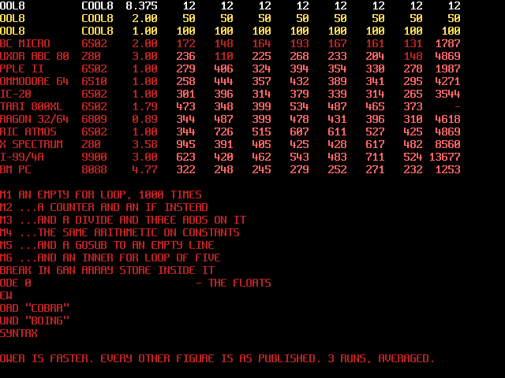

**The model is the published one.** 28 vertices, 38 edges, 13 faces and
the edge-to-face table of the Cobra Mk III, transcribed by
`tools/mk3d.py` from the annotated BBC Elite source at
[bbcelite.com](https://elite.bbcelite.com/6502sp/main/variable/ship_cobra_mk_3.html).
The generator asserts the counts against what the source states and
emits `DATA`; no importer, no conversion step on the machine.

**The tilt is baked, the spin is runtime, and the order is the trick.**
The host rotates the ship 20° about X once; BASIC spins it about the
*view's* vertical axis — `RotY` after the tilt — and a Y rotation never
touches y, so each vertex's screen Y is one constant and only screen X
moves. Startup fills 72 frames × 28 vertices of screen X and unpacks
each frame's visible edges into flat endpoint arrays, all integer, the
worst product asserted at 23,495 of a signed 16-bit's 32,767.

**There was a see-through wireframe mode, and it was eliminated by
decision** — the hidden-line ship is simply better, and one mode is
one code path. Its lessons stayed: the profile that shaped this loop
(`python sim/test_run.py --profile cobra`) measured the wireframe's
frame at **31.5 % `CLG`, ~15 % nested-subscript machinery, ~13 %
drawing**, which is why this demo erases by redrawing the
two-flips-old frame's edges in black instead of clearing 24,576 bytes,
and why every `LINE` argument is a single-subscript array read. Two
`CLG`s at start cover pages never yet drawn.

**Visibility is decided by the projected polygon, not the published
normal.** Elite's normals are hand-rounded integers — `(0,62,31)` is
near its face's plane, not on it — so a normal-based cull flipped a few
degrees away from where the *drawn* geometry turns edge-on, and edges
vanished while their faces were still visibly open. The generator
walks each face's boundary loop out of the edge table (spurs like the
laser line pruned), calibrates its winding once against the published
normal far from the silhouette, and then decides every frame by the
**signed area of the face under the exact integer projection the
machine draws**, with a 150 px² grace margin so a closing face holds
through the transition. The revolution is asserted flicker-free — no
edge visible, gone one frame, visible again. Cost, measured: 24.6
edges a frame mean against the normal cull's 23.6, worst 33 against
32 — **accuracy priced at about one `LINE` a frame**, which was the
constraint set for it: all of this runs in the generator, and the
machine only ever `READ`s shorter or equal lists.

**First user of mode 5's double buffer, and it shipped wrong twice** —
worth keeping because both claims sounded right. The first cut flipped
`VID_BASE` alone and called the viewer safe; false — the fetch
re-latches the base every frame start and a drawn frame takes several,
so the display followed the page under construction and the `CLG` was
a visible black frame between ships. [D92](01-decisions.md) split the
glass from the pencil: `VID_DBASE_H` names the page the display scans,
`VID_BASE` steers only the drawing. The second cut flipped both with
two `POKE`s after `VSYNC`, and that was a frame wrong: the fetch takes
`DBASE` at the frame start, on the pulse that ticks the counter
`VSYNC` waits for, so a `DBASE` written after `VSYNC` reached the glass
a frame late — and `BASE`, moved to the old page in the same line, had
the erase begin on the page being shown. Measured on the glass, **at 9
flips of 9 the first frame after the flip was the old page mid-erase**:
on one, 452 of the new page's 621 pixels were missing, and all 348 lit
pixels it does not hold were the page before's. One display frame in
four or five showed the outgoing pose with lines already erased, where
the new one belonged. The flip is now `POKE $FF30,P:VSYNC`, then
`POKE $FF13` to the other page — the order [D105](01-decisions.md)
amended D92 to after the compiled COBRA found the same fault.

**Measured: 4.5 display frames a drawn frame (4–5), ~13 fps, and every
frame on the glass is a finished page.** `sim/test_run.py`'s
`cobra_flips` holds it on the rendered frame, not on the registers. It
finds each flip exactly — parked in the `VSYNC` wait the page is done,
and the next `stmt` is `VSYNC` returning, just past the frame start
that latched the display base — and requires the first two frames
scanned after the flip, and the last before the next one, to be the
finished page pixel for pixel, 396–647 pixels a ship. **The probe it
replaced read `VID_DBASE_H` and `VID_BASE_H` every frame and passed
with the flip in the wrong order**: the registers read a page apart
either way, and a register is not the glass. Registers are still read
through `bus.read()` — `bus.mem[]` is the RAM *under* the I/O page, the
mistake `cool8_soc_tb`'s "the page wins" section exists to catch.
**The recorded next lever is the interpreter's, not the demo's**: name
lookup (`nentry`, `nlook.*`, `varidx`, `aelem`) is ~36 % of a frame,
and a `nlook` memo in `prg_find`'s two-slot shape is the candidate.

**The compiled COBRA is a different program** since
[D105](01-decisions.md): the same ship, tumbling on three axes, every
frame computed at 60 Hz -- its section is with the CoolAction menu's.

### `SYNTH` — the screen is the sequencer

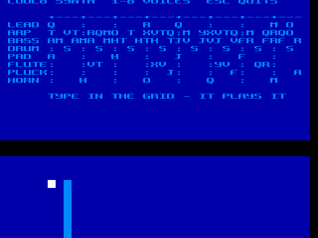

**A port of [tomcoolpxl/c64-synth](https://tomcoolpxl.github.io/c64-synth/),
its trick kept whole: the sequencer has no note array — it reads the
characters on the screen.** The original PEEKs its virtual C64 display
("what you see is literally what you hear"); COOL8 does it natively,
because modes 0/1 are text in *main* RAM — the play loop `PEEK`s the
very bytes `PRINT` painted, through the map at `VID_BASE`. Mode 1 is
the 40-column screen; a char is a note by A=1..Z=26, anything else a
rest, `:` a rest that draws the beat.

**Melody, tuning and instruments are the original's.** The three
DEFAULT_TRACKS ride verbatim in their `PRINT` statements (`DATA` is
numbers-only here — the first cut tried `READ A$` and learned it at
`?SYNTAX`); pitch is the synth's own SID arithmetic, f = 40 · 1.0595^
(note+mask) · 985248/2²⁴ Hz with masks 82/70/46, its slightly-sharp
1.0595 semitone reproduced deliberately, precomputed to `DATA` as
COOL8's ~2·Hz register values. Tempo: the original's 160 ms step is
9.6 frames at 60 Hz; **9 frames — 150 ms, slightly faster — by
decision.**

**Seven voices, an editor, and one percussion line** — keys 1–8
toggle voices live (the digit lights or dims), **arrows move a cursor
in the grid, letters and space type straight into the memory the
sequencer plays**, Esc quits. There were briefly two percussion lines:
the bass row's invisible rest-snare (the original's `bass_snare` flip)
plus a new drum row — so the flip is gone and **the drum row IS that
percussion made visible**, derived by the generator from the bass
track's own rests, one S per bar off-beat. K (kick) and H (hat) decode
too, waiting to be typed. The pad, row 5, holds each bar's root —
also derived, the bass line's own bar-start notes, soft and sustained.
**All eight voices are visible, editable rows now.** The bass was
checked against the source: its instant cut on rests matches the
original's zeroed oscillator, the snare split off correctly, and the
one thing out of reach is the sawtooth itself -- square is the only
tone this chip has. What was off was balance, now the original's own
ratios (lead .35 / bass .3 / arp .2 mapped to 10/9/7). The drone is
gone -- awful, by verdict -- and its row holds the **pluck**: three
anticipations on a clean mid square — the coming bar's root one step
before each chord change, cut by the next beat mark. J into bar 3, F
into bar 4, A leading home. Row 8 is the **horn**: brassy mid-register stabs of each bar
root's fifth on the bar mid-beats, derived by lettering seven
semitones up the bass line. **Space types the bar mark**: on a beat
column (every fourth, the original's own convention) it writes `:`,
elsewhere a plain rest, and every generated row carries its beat marks
the same way. One bug worth its ink: the first F=1 ran before any
step had set `C`, so the fx voices PEEKed the program's own token
bytes as notes and one indexed the pitch table out of range --
surfacing as `?SYNTAX` over the `?INDEX`, the interplay
`sw/interp.asm` documents. `C` is initialised now; the old version had
merely been lucky about which bytes its offsets hit.

Row 6 is the **flute** — fleeting high two-note sparkles placed in
the lead's rest gaps, each drawn from that bar's own arpeggio tones,
played an octave above the lead at low volume with a fast fade, which
is what makes a square wave stop being a buzzer. The bass drone keeps
voice 7; 8 is spare. Typing accepts lowercase and upcases it — the
first field report was "i cannot type letters", because the gate had
only ever typed a *shifted* C while a real keypress arrives unshifted.

**The whole screen is C64 colours**: all sixteen of bank 0's slots
repainted with the machine's own Commodore 64 palette, border light
blue via `VID_BORDER`, light-blue-on-blue attributes, the playhead an
inverted column moved pairwise, the cursor a white cell.

**The step is staged across three frames, and the gate is why.** All
the work on one frame overran 16.7 ms and the tempo gate caught it —
one frame per step showed the playhead restored but not yet lit. Now
F=0 reads the melodic rows, F=1 the echoes, drone and drums, F=2 moves
the playhead; every frame stays inside the budget it must share with
eleven envelope statements.

**Gate-enforced** (`synth_screen`): mode 1; rows 3–5, columns 7–38
hold the c64-synth tracks byte for byte; exactly one lit column per
frame; the playhead steps every 9 frames and walks the 32 columns in
order — which is also the proof the whole loop runs, `SOUND`s
included, since any BASIC error stops it. The gate reads through
`VID_BASE`, having first been written with a computed screen address
and caught by the scroll — the exact mistake the rule exists for.

### `PLASMA` — paint once, animate only the palette

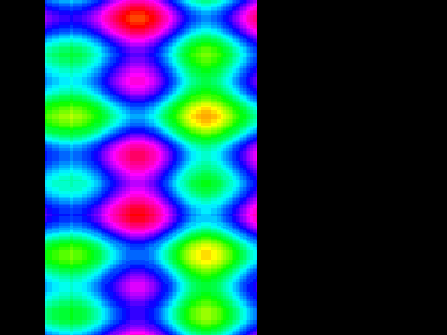

**The pixels never move.** Mode 6 is painted once with a fixed
interference field and the animation is palette rotation — the colour
under every pixel slides along a 47-entry cyclic rainbow while VRAM
stays byte-for-byte still. It is WAVE's palette lesson run backwards,
and the suite holds it literally: the VRAM byte at a sampled point
must not change between frames while the rendered colour of the same
pixel must.

**The field is separable — colour(x,y) = A(x)+G(y) — and that is what
makes it paintable.** Two integer interference tables (two sine voices
each, host-computed, `DATA`), summing to 1..46, so the paint loop is
one statement a pixel through `PIX_DATA`'s auto-increment: ~25 s of
visible top-down fill that is its own progress bar, MANDEL-class and
in bounds. A non-separable field at this interpreter's speed would be
minutes. The gate checks the painted VRAM against the stored `DATA`'s
own sums.

**47 colours, and why not 240**: rotating a palette costs two
`PAL_DATA` pokes an entry, so a 240-entry rotation is a third of a
second — 3 fps. 47 stream in ~90 ms through the port's auto-increment,
which paced by `VSYNC` is the slow oily flow plasma wants. The wrap
costs nothing: the palette arrays are emitted doubled, `H(O+I)`, so
the inner loop carries no `IF` — an `IF` that skips its `NEXT` being
the classic trap. Regenerated by `python tools/mkplasma.py`; any key
exits.

### `INTRO` — the scroller, hardware doing the work

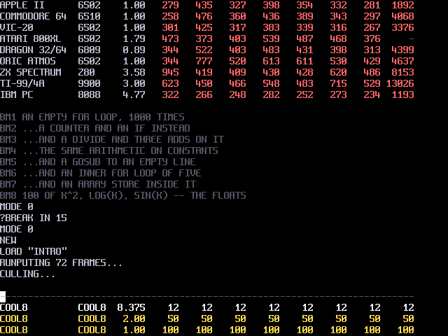

**The motion costs four POKEs a frame.** Mode 1 stores 80 columns and
shows 40, so the display is a window on a wider banner: fine scroll
walks the 8 logical pixels of a cell (`VID_SCRL_X` — [D93], the drift
this demo caught: §5.5 documented text fine-X while the silicon passed
text through unmoved), and the coarse step is a two-byte `VID_BASE`
slide. Every row is written 40-column periodic — halves identical,
gate-checked byte for byte — so when the window has slid 40 cells the
base snaps home invisibly: an infinite scroll with zero redrawing. The
whole screen bobs on `VID_SCRL_Y`'s sine, the border flashes white on
every snare, and the message letters carry a static rainbow of
attributes.

**It shuddered once every eight frames, and the port is what found
it.** The banner stepped left two pixels a frame, then on the frame
where the fine step wrapped to 0 it jumped a whole cell to the right
and came back the frame after — "some of the text is shifted", seen
on the glass and not by any gate. Measured on the renderer by writing
the demo's register pair by hand at the frame boundary and reading a
glyph's x back: −2, −2, … +14, −18, −2. The cause is in
[04-system.md §5.5](04-system.md): text fine scroll is live while
`VID_BASE` is latched at vblank, so a fine step and a base written
together after the frame wait land a frame apart, and the tile idiom
of "coarse step with fine step 0" is exactly wrong for text. The base
is now written a frame ahead, in the BASIC and in `intro.act` alike,
and the pair gate holds the two to the same registers on the same
frame.

**The music is SYNTH's top three voices, verbatim** — lead, arpeggio,
bass-with-snare, same pitch tables and envelopes, 9 frames a step —
with the tracks carried as arrays: this screen belongs to the
scroller, and SYNTH keeps the screen-as-sequencer trick where it means
something.

**The gate is D93's end-to-end proof**: rows periodic, SCX walking
exactly the eight fine positions, even-byte base steps, SCY moving,
and — the line that failed until the fetch, the renderer, the
testbench model and the harness all agreed — **the rendered glyphs
actually sliding across frames**. The way there found the harness bug
worth the trip: suite machines rendered text with no font, so glyphs
had never lit in `fb()` and a cursor toggle looked like a display
kill. Every rendering machine loads the real font now.

### `BOING` — the Amiga's ball, and not one pixel redrawn

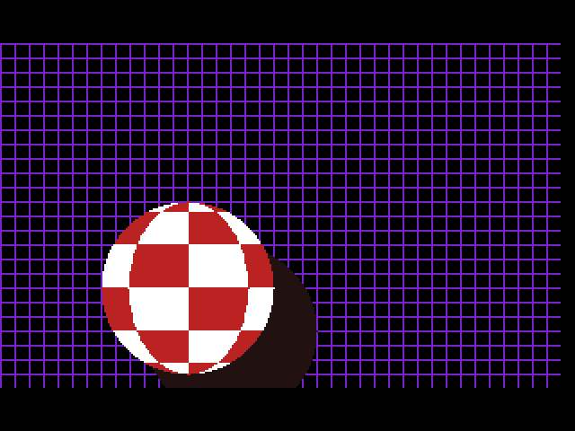

The 1984 Boing demo, in BASIC, at 60 Hz. A 96-pixel checkered ball on a
256-pixel screen, a shadow behind it, and a purple room — and the loop
that runs it is **four `POKE`s a frame**.

**Nothing is redrawn, because nothing can be.** A ball this size is
about 7,000 pixels; the interpreter manages ~12,000 statements a second
(`MINIBNCH`), so any per-frame blit from BASIC is a slideshow before it
starts. So the ball, its shadow and the room are painted **once** into a
416×288 canvas — 1.6 s, all of it horizontal `LINE` spans — and the
display's 256×192 window is then walked over that canvas:

| axis | register | step |
|---|---|---|
| x | `VID_SCX` | a bitmap gets the full ten bits of fine scroll for nothing (§5.5), so one logical pixel |
| y | `VID_BASE` | one row is one pixel, and a row is what the base must move in |

Mode 5 rather than mode 4 for the room it leaves: the viewport is
256×192, so 416×288 of VRAM buys **160 pixels of travel across and 96
down**, and the ball is placed so it touches all four edges at the ends
of both. The `sim/test_run.py` gate is exact about the claim — every
byte of VRAM must be **identical** before and after the flight while the
ball crosses the glass.

**The room stands still because the window steps a whole cell.** The
window carries the room with it, so the grid has to be invariant under
the step: it repeats every 8 pixels and the window moves in eights. The
price is an 8-pixel quantum, and it is bought back in the *timing* —
the flight is integrated in sixteenths of a pixel and snapped to eight
only at the `POKE`, so gravity is where the eye reads it: the ball hangs
at the top of the arc and flies at the floor. The gate holds the grid by
its lattice phase rather than its position, because the ball occludes
part of every row it crosses.

**The spin is the palette, which is how the original did it too.** Eight
entries carry the checks — the index encodes the meridian mod 4 and the
band's parity — and rotating them walks the pattern round the ball in
four phases for 24 `POKE`s. The meridians themselves are cosine-spaced,
so they crowd at the edge the way a sphere's do, and the rotation reads
as a sphere turning rather than a flag waving.

**One trap worth the writing down: a subroutine's loop counter is a
global.** The palette routine counted `FOR P = 0 TO 7` while `P` was the
ball's x position, and every third frame the ball was quietly reset to
the left wall — which looks exactly like a physics bug and is not one.
`LOCAL` exists only inside a `SUB` ([13-basic.md §1](13-basic.md)); a
`GOSUB` shares the whole namespace, and in this BASIC that namespace is
26 letters.

### `TRIANGLES` — the BBC Micro's filled triangles, without the primitive

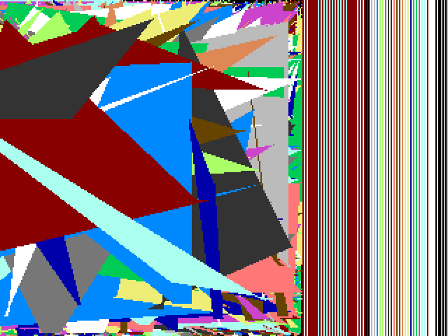

```
MODE 2:REPEAT:GCOL 0,RND(16)-1
MOVE RND(1280),RND(1024):MOVE RND(1280),RND(1024)
PLOT 85,RND(1280),RND(1024):UNTIL FALSE
```

is the demo every BBC Micro and every Agon runs first. `PLOT 85` is a
filled triangle in the OS; this machine has no such primitive, so the
fill *is* the program — sort the three points by Y, walk two edges down
the shape, and join them with one horizontal `LINE` a row. Mode 4, so
the 16 colours the original asks for, over the whole 320×240.

**Horizontal is the entire performance argument.** A flat `LINE` sets
the pixel port once and lets it step X itself — 22 cycles a pixel
against Bresenham's 209 ([D89](01-decisions.md), and
[13-basic.md §5](13-basic.md)) — so the shape is chosen to be drawn in
spans, and the only thing that happens per *pixel* is machine code. The
edges step in sixteenths of a pixel, which buys one divide an edge
instead of one a row.

**`>>` is a logical shift here** ([13-basic.md §2](13-basic.md)), so an
accumulator that ever went negative would come back as 32000-odd and
`LINE` would write far outside the 38,400-byte surface — over the
`GTEXT` font, among other things. It cannot, because it interpolates
between two on-screen points; `sim/test_run.py`'s `triangles_fill`
holds every byte of VRAM above the surface against what it was before
`RUN` rather than taking the argument's word for it.

**Measured: 11.2 triangles a second, 5.4 display frames each.** The
profile says where that goes — `python sim/test_run.py --profile
triangles`: `hrun` (the span itself) **14.3 %**, `varidx` 11.1 %, and
the rest spread across `prim`, `eval`, `erel` and `stmt`. It is
statement-bound, not pixel-bound, which is the same finding `WAVE`
records from the other end: in this BASIC the cost of a loop is the
statements in it.

**So the row was written out twice to save a `NEXT`, and it measured
slower — 10.7 against 11.2.** Unrolling only pays if the duplicate is
free, and the second row's `I+1` has to be evaluated in two arguments
where `NEXT`'s own increment is one add nobody parses. Four statements
a row is the floor here: the `LINE`, the two edge steps, and the
`NEXT`.

Colours are 1–15, not 0–15: entry 0 is the paper, and a triangle
painted in it is a triangle nobody sees. The disc name is `TRIANGLE` —
eight characters is the filesystem's limit and the source keeps the
plural.

### `MINIBNCH` — ten thousand adds, timed by the machine's own clock

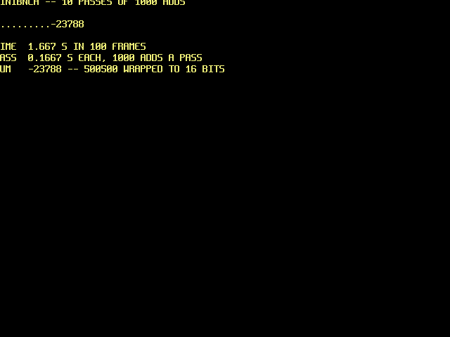

Ten passes of a thousand `S=S+J`, with a dot a pass, and the time it
took. The listing inside the timing is exactly what was typed at the
machine; everything else is the clock around it, and the marker dots
stay *inside* the measurement because they are part of the program
being timed.

**`TIMER` is the clock and one tick is 16.7 ms.** It is the vblank
count at 59.97 Hz, so a run of a hundred frames is measured to about a
percent — six times finer than the tenth of a second asked of it, with
no calibration and nothing to drift. It wraps at 65,536 frames and the
subtraction wraps with it, so only a run past nine minutes would need
the third byte at `$FF2F`.

**Measured: 99–100 frames, about 1.66 s — 0.166 s for a thousand
adds**, which
is about 12,000 interpreted statements a second (each pass is the add
and the `NEXT`). That is the number to reach for when asking whether
something belongs in BASIC or in a `SYS` routine, and it is why
`TRIANGLES` above is statement-bound.

**The answer is `-23788` and it is right.** `S` is an integer, so
500500 comes back as its low sixteen bits; `S#` would hold the value
but only to about five digits, and would take five times as long to
get there. The demo prints the wrapped figure and says so.

`sim/test_run.py`'s `minibnch_clock` reads `TMR_L`/`TMR_M` itself on
either side of the run and holds the printed frame count against its
own — a demo that reports a time is worth exactly what its clock is
worth. It is also what found the console bug in
[13-basic.md §5](13-basic.md)'s `MODE` row: this was the first text
demo to open with `MODE 0 : CLS`, and it printed into the middle of the
screen.

### `BAPPLE` — Bad Apple, streamed from the dedicated drives

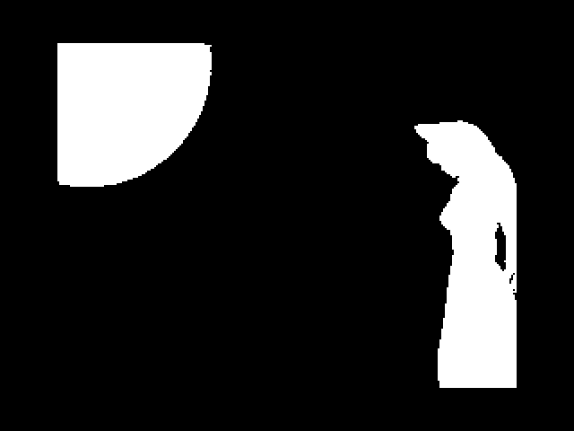

**What ships is the first 344 frames, on drive 12 alone** — seven
chunks, the opening of the film, and the stub `BAPPLE` on the demo
disc that plays them. **The whole film was built and plays frame-exact
end to end**: 3,481 frames extracted at 15 fps, 224 of black-and-credits
tail trimmed by a coverage threshold (the credits are two static text
cards under 2% lit; the film's last real frame lands to black at
217.1 s), leaving 3,257 frames -> 5,259,513 bytes in 82 chunks. Verified
by parking the VM at the VSYNC wait every four hardware frames for the
*whole film* and requiring both VRAM pages to equal the reference
decoder's state, park after park -- every frame from 0 to the last
matched exactly.

**Why it is capped, and where the cap lives.** The full stream is
5,259,513 bytes against 454,656 usable a volume — 11.57 volumes — so
the full build took twelve drives, 12 downward, and its lowest was
**drive 1, `USER_VOL`**, where a cold machine comes up: the whole-film
plan always collided with the user's own disc. An earlier session cut
the disc to drive 12 alone, but the cut lived only in
`demos/bapple/manifest.json`, which `.gitignore` excludes, while
`tools/mkbadapple.py` went on saying `range(12, 0, -1)` and this
section went on describing the twelve-drive film — so a rebuild from
the mp4 would have walked straight back over drives 1 to 11 without a
word. Now the generator's default drive list is `[BAPPLE_VOL]`,
`--drives 12,10,9` asks for more, `plan()` refuses any drive in
`cool8disk.CLAIMED`, and `tools/mkdemos.py` asserts the same thing on
every chunk it places, so a manifest from before the cap fails the
build rather than the user. Rebuild the shipping cut with
`python tools/mkbadapple.py badapple.mp4` — the stream stops when the
drive is full, which is the 344 frames — or `--frames N` for fewer;
the full film is `--drives 12,9,8,7,6,5,4,3,2` -- drive 10 is the
picture drive now ([D103](01-decisions.md)), claimed, and the planner
says so if it is asked for, as it says when the stream outgrows the
drives it was given -- and it is not in
the tree because the full build's directory is kept beside the cut,
unused, with a `README.md` saying which half is live. The mp4 stays
out of the repository.

**Fitting was a planner problem, not an encoder problem.** The encoder
absorbs unchanged same-value bytes into runs and only pays a skip
token for stretches of eight or more, which brought the stream to
5.31 MB against 5.41 MB of raw drive capacity -- but a planner that
only cut 64 KB chunks wasted each drive's unreachable tail, 720 KB of
packing loss, and reported the stream as not fitting. Chunks are now
cut against the file-size cap and the drive's remaining space at once
(the last chunk on a drive fills it), and the planner predicts the
256-byte page alignment `Volume.add` gives every file start.

**Why this port is easy where every other 8-bit port was hard**: flash
is 8 MB and `FLS_DATA` auto-advances, so streaming is native and plain
delta-RLE at 256×192/15 fps (~2–4 MB) needs none of the heroics — the
C64's 170 KB vector quantisation, the BBC's floppy choreography — that
define the genre. The fight everywhere else is storage; ours was only
decode speed, and 8.375 MHz settles it.

**The stream**: frames become mode 5 byte planes (two pixels a byte),
delta-encoded against the frame *two* back — pages alternate under the
D92 double buffer, so a page's previous content is two frames old.
Tokens: `$00` end-of-frame (flip `VID_DBASE_H`), `$01–$7F` a run of
the next byte through `VRAM_DATA`'s auto-increment, `$80–$FF` a skip
of token−127. Frames 0 and 1 ship full, so nothing needs clearing.

**The decoder is 68 bytes of machine code** at $9000, assembled by the
generator through the harness with register addresses stamped from
`tools/ioregs.py`, POKEd from `DATA` by the stub, one frame per `SYS`
from a four-`VSYNC` loop — BASIC keeps the tempo and the exit key.

**Dedicated drives, in the order `--drives` gives them**: the catalogue
caps a file at 65,535 bytes, so the stream ships as `BA###.DAT` chunks
split at frame boundaries. Volume files are contiguous from a fixed offset, so the
planner *predicts* each chunk's absolute flash address into the stub's
table, and `mkdemos` asserts the prediction when it places them — a
chunk landing anywhere else would stream garbage from a right-looking
drive. Between chunks the stub closes `FLS_CTRL`, re-points the
address, reopens.

**Two build-order traps, both now held by assertions.** First, the
chunks used to be written into the image file while the disc-building
machine was already running; the `flush()` after `SAVE "BAPPLE"` put
the machine's pre-chunk flash back over the file, leaving erased $FF
where the stream had just been placed -- every placement assertion had
passed, on an intermediate state. `mkdemos` now places the chunks
*before* the machine boots and re-reads every chunk from the finished
file. Second, the stub was typed over the previous demo without a
`NEW`: every line number the stub does not use survived, and WAVE's
colour-ramp DATA lines 205-249 sat between the decoder DATA (200-204)
and the chunk table (250+), so `READ` served palette bytes as flash
addresses. The program LISTed clean line for line -- only dumping the
READ stream itself showed the ramp. The fix is one `NEW`; the gate now
types a decoy demo first to keep the scenario alive.

**Gate-enforced** (`bapple_decodes`): a fresh synthetic clip is
encoded, placed, and played -- the stub typed over a decoy program, as
the disc build types it; both VRAM pages must then equal a consecutive
reference frame pair with the right parity — the token walk, the flash
auto-advance, the VRAM auto-increment, the skip carry and the page
alternation in one comparison. **The flip is held on the glass**:
twenty-two consecutive display frames must each be a whole frame of
the clip, in order, four apiece. BAPPLE never had COBRA's flip fault —
the decoder writes `VID_DBASE_H` as its last store, before the stub's
four `VSYNC`s, the order [D105](01-decisions.md) amended D92 to, so a
page has left the glass before it is decoded into — but the gate used
to read the register, and now it reads the frame. Sound is a later,
separate step, by decision.

### `TAIPAN` — the 1982 China Sea trading game in 40-column Mode 1

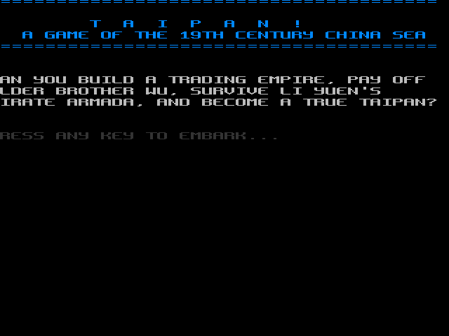

A port of Art Canfil & Ronald J. Berg's classic 1982 adventure game *Taipan!*,
ported to COOL8 BASIC in **Mode 1 (40×30 text mode, 16 foreground/background colors per cell)**.

**All mechanics are preserved**:
- Trading 6 goods (Opium, Silk, Tea, Arms, Pepper, Rice) across 10 historical ports.
- Debt, loans, and compound interest with Elder Brother Wu in Hong Kong.
- Hong Kong godown (warehouse) cargo storage.
- Random market shifts, events, extortion, Li Yuen's pirate fleet, sea battles, typhoons, and ship upgrades.
- Historical price tracking per port and per commodity.

**Language and platform specifics**:
- Runs in native 40×30 text mode (`MODE 1`) with per-character foreground and background colors (`COLOR fg, bg`).
- Uses 24-bit floating-point numbers (`M#`, `D#`, `Q#`, `AP#`, `GP#`, `HI#`, `LO#`) to represent currency and prices beyond 16-bit bounds.
- Custom sound effects through the 8-voice audio subsystem (`SOUND`).
- ASCII ship graphic rendered in Mode 1 during pirate encounters.

### `COOLTRIS 1` — 1-player arcade Tetris in 40-column Mode 1 with CP437 character graphics

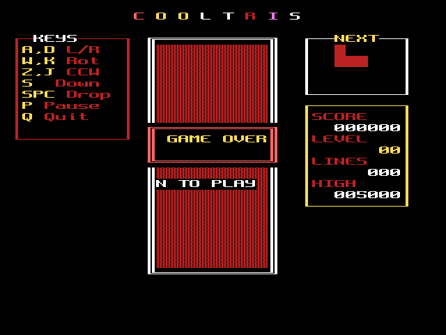

Classic 1-player arcade Tetris implemented in COOL8 BASIC using **Mode 1 (40×30 text mode)** and CP437 character graphics (`demos/cooltris.bas` / `demos/cooltris1.bas`).

**Game mechanics & features**:
- Standard 10×20 playing matrix with authentic double-line box border (CP437 201, 205, 187, 186, 200, 188).
- Complete 7 tetromino set (I, J, L, O, S, T, Z) with standard color palette, 4 rotation states each, and double-width solid block characters (`██` CP437 219).
- Modern 7-Bag randomizer ensuring uniform piece distribution without droughts.
- Ghost piece / drop shadow preview (`░░` CP437 176) showing real-time landing position.
- SRS wall kicks for clockwise (`W`, `K`, `X`, `Up Arrow`) and counter-clockwise (`Z`, `J`) rotation against board boundaries and stack obstructions.
- Soft drop (`S`, `Down Arrow`) and hard instant drop (`Space`).
- Real-time NEXT piece preview window in sidebar with single-line box border.
- Sidebar showing 6-digit score, level, lines cleared, and persistent session high score on separate lines.
- Anti-hover hardware timer synchronization (`TIMER`) ensuring gravity drops strictly in real-time regardless of input frequency.
- Clean square-wave sound effects (`SOUND voice, pitch, vol, 0`) for movement, rotation, soft drop, locking, single/double/triple/Tetris line clears, level ups, pause, and game over.
- Game over curtain animation (`▓▓` CP437 178) with high-score tracking, replay prompt (`N TO PLAY`), and pause (`P`).

### `COOLTRIS 2` — Arcade Tile Engine Tetris in Mode 2 with Custom 4 bpp Graphics and 7 Palettes

Classic arcade Tetris re-engineered for **Mode 2 (40×30 Tile Mode, 320×240 doubled)** with custom 4 bpp tile patterns, multi-bank color palettes, and direct VRAM streaming (`demos/cooltris2.bas`).

**Architecture and tile engine specifics**:
- Runs in native 40×30 tile mode (`MODE 2`), leveraging the OS auto-font at VRAM `$1000..$1BFF` (Tiles 0..95) alongside 17 custom-designed 4 bpp arcade tiles at VRAM `$1C00..$1E1F` (Tiles 96..112).
- **Custom 4 bpp Arcade Tile Set**:
  - Tiles 96 & 97: 3D beveled block halves (left/right specular highlight and core shadow) creating 16×8 arcade tetromino minos.
  - Tiles 98 & 99: Fine 1-pixel ghost landing outline tiles.
  - Tiles 100–105: Ornate gold double-rail border set (horizontal, vertical, corners).
  - Tiles 106–111: Sleek silver single-rail box borders for NEXT preview, Keys, and Stats windows.
  - Tile 112: Textured arcade curtain dissolve effect for game over sequence.
- **7-Bank Color Palette**:
  - Each piece uses an authentic 4-color shading ramp (highlight, base, midtone, shadow) mapped across 7 independent 16-color palette banks (`$FF1E..$FF1F`).
  - Pieces retain crisp 3D depth and distinct arcade identity (Cyan I, Blue J, Orange L, Yellow O, Green S, Magenta T, Red Z).
- **Direct VRAM Streaming**:
  - Uses fast hardware auto-incrementing VRAM address registers (`$FF26..$FF29`) to stream tile index and attribute bytes in ~0.15–0.48 ms per frame (< 3% of the 60 Hz frame budget).
- **Audio & Timing**:
  - Crisp noise-free multi-voice square wave sound effects (`noise = 0`), anti-hover hardware timer synchronization (`TIMER`), pause (`P`), game over restart (`N`), and clean exit (`Q`).

### The CoolAction menu — eight of the demos, compiled, and programs of its own

The same demos in CoolAction! ([15-action.md](15-action.md)), on
drive 11 as bare `.BIN`s: RAINBOW, TRIANGLES, MAZE, PLASMA, WAVE,
MANDEL, SYNTH and INTRO, each a `demos/name.act` beside its
`demos/name.bas`; COBRA, which was the ninth and is now a program of
its own, and COBRA2, its camera and sky, the next two sections; and
KEYTEST, MSCOOLMN, ARKANOID and SLIDES, which have no BASIC and follow them. **The picture is the contract, not the code.** A port
may do the work any way the language allows -- and mostly does it the
BASIC's way, because the BASIC's way was measured -- but
`sim/test_action.py` runs every pair to the same point and requires
what the machine holds to be identical: VRAM, palette, the text map,
the programmed voices, the registers. Every one of the nine -- COBRA
then among them -- matched on its first run against its original, which is what the library's
`Line` being `LINE` pixel for pixel and `Rnd` being `RND` from the
same seed bought.

**Where each pair is parked, and what must agree:**

| port | parked at | identical |
|---|---|---|
| RAINBOW | the 40th frame wait | 38,400 bytes of mode 4, 16 palette entries |
| TRIANGLES | the 281st `RND` -- forty triangles in | 38,400 bytes of mode 4 |
| MAZE | the 1,341st `RND` -- the map and twelve scroll steps | the map and the tile, the palette, `VID_BASE`, `VID_SCY` |
| PLASMA | the 5th frame wait -- painted, four rotations in | 61,440 bytes of mode 6, 47 palette entries |
| WAVE | the 120th frame wait | 61,440 bytes, all 256 palette entries |
| MANDEL | the key wait at the end -- the whole set | 61,440 bytes, all 256 palette entries |
| SYNTH | the 120th frame wait -- thirteen steps of the tune | the 5,120-byte text map, eight voices' pitch, volume and bits, the palette, the border; then the editor typed at |
| INTRO | the 120th frame wait | the text map, the voices, `VID_BASE`, `VID_SCX`, `VID_SCY`, the border |

A frame wait is a routine entry on both sides -- `h_vsync` in the
interpreter, `WaitVBlank` in the library -- and so is an `RND`, so the
two machines are at the same point of the same algorithm whatever the
clock says. Where the demo has no frame wait, the count of random
numbers *is* the clock.

**What a port changes.** `READ`/`DATA` becomes an initialised array;
`tools/mkactdata.py` copies every BASIC's `DATA` into a marked block
of its `.act` -- PLASMA's tables and rainbow, WAVE's sine and
253-entry ramp, SYNTH's and INTRO's tunes, MAZE's palette and tile --
and `poe check` fails if a block is stale,
so a change to a model or a palette in the BASIC fails there rather
than in the framebuffer. `DIM` is a declaration, `0-Q` is `-q`, a
`POKE` to a register is the register's generated name, a `POKE` to the
text map is the machine's own base plus the BASIC's offset, `INKEY` is
`ReadKey()` on the interpreter's own keyboard tables, and `RND` is
`Rnd()`, the interpreter's xorshift from its seed -- which is why
TRIANGLES and MAZE, pictures made of nothing but random numbers, match.
MANDEL's coordinates are `BYTE` where the BASIC has integers, because
a screen coordinate is 0-255 by construction; the arithmetic that must not be narrowed -- MANDEL's Q6
iteration, WAVE's `o < y - 1` at the top of the screen, TRIANGLES' edge
accumulators -- is `INT`, and every divide truncates towards zero as
the BASIC's does.

**What the pairs measure.** COBRA, while it was a port, measured the
two ends: its start-up -- 2,016 projections and 1,772 table gathers --
was **36× faster** compiled (1.4 M clocks against 50.5 M), and a
frame's drawing 2.4× (239 K against 578 K), because `Line` and `LINE`
are the same algorithm and the compiled one, at 97 clocks a pixel, had
only just overtaken the interpreter's 101-181; neither held 60 Hz. **MANDEL is 35×**: the whole set in 60.5 M clocks
against 2,126 M -- 7 s against 4 min 14 s of machine time -- with the
same Mariani-Silver rectangles and the same Q6 iteration, which is the
arithmetic-and-array-traffic case the sieve profile predicted. Those
are the figures after the compiler's optimiser
([15-action.md §4a](15-action.md)); before it they were 18.7×, 2.0×
and 7.1×, and reading these ports' hot loops is what found the
patterns. PLASMA's 25 s of visible top-down paint is a fraction of a
second. RAINBOW, WAVE, SYNTH and INTRO sit in the frame wait either
way and gain nothing a viewer can see. The full table is in
[15-action.md §5](15-action.md).

**`PRIMES` is on the same menu**, because it is `demos/primes.act` and
the disc is derived from `demos/`: it counts the primes to a thousand
and says so on the serial port, which the page does not show. A
demonstration that a compiled program reaches the hardware, not a
picture.

**Two things the ports made visible.** `CLG` clears 240 rows of the
stride in every mode (`h_clg`), which in mode 5 is 30,720 bytes from
`VID_BASE` -- 6,144 past the page -- so the COBRA port's second
clearing frame wiped the top 48 rows of the page then on show; it
lasted one frame, the library's `Clg` does exactly the same, and the
two framebuffers agreed. And a voice's phase accumulator, bytes 2 and 3 of its eight,
can never be compared between two machines: the engine advances it
every 256 clocks from the moment the pitch lands, and two programs
that write the same pitch in the same frame write it at different
clocks. The gate compares pitch, volume and the mode bits, which is
what the program wrote.

### `COBRA`, compiled — the tumble, every frame computed

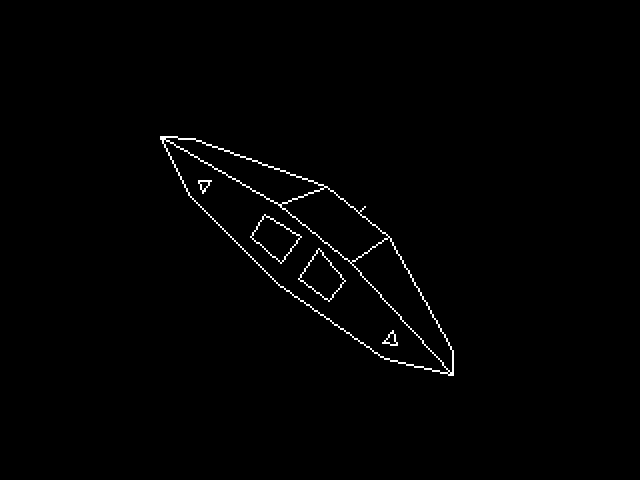

**The same ship, a different program** ([D105](01-decisions.md)).
`demos/cobra.act` tumbles the Cobra Mk III on three axes and computes
every frame between two vertical blanks -- the rotation from three
angles, the 28 vertices through it and into perspective, the 13 faces
culled, the visible edges erased and drawn -- in 55,958 of the frame's
139,583 clocks, so it holds 60 Hz with 60 % to spare. The BASIC's
COBRA replays 72 precomputed frames about one axis at about 13 a
second, and the compiled port of it drew 30.

**A mode no preset names**: 256 × 240 at 4 bits a pixel -- mode 6's
timing, `VID_CTRL = $3A`, a stride of 128 -- which is 30,720 bytes a
page, so both pages of a double buffer fit VRAM. At 4 bits the pixel
port plots in one store and steps X or Y itself, and a line is 14
clocks a pixel. **The page is flipped before the frame wait, not
after**: the fetch takes `DBASE` on the pulse that ticks the frame
counter, so a flip after the wait lags a frame and the glass shows the
page being redrawn -- which the first cut did, D92's order still said,
and the BASIC COBRA did at every flip until its gate compared the
glass.

**Assembly where the profile put the clocks**, compiled CoolAction!
everywhere else:

| a frame | clocks | |
|---|---|---|
| the lines, the last frame's erased and this one's drawn | 30,457 | assembly: a store and an error step a pixel |
| 28 vertices onto the screen | 13,658 | assembly: the unsigned `MUL` with 128 carried in, the surplus off as two constants |
| 13 faces and the edge list | 8,618 | the faces in assembly, the same multiply-add; the list compiled |
| the rotation | 1,856 | compiled: fifteen products from a 1,024-step sine table |

**The faces are culled by their normals**, each its own triangle's,
with 256 of hysteresis: the BASIC's area on the screen flickered at
this speed, because near edge-on a thin face's area is the rounding of
its corners. `tools/mk3d.py` writes the model and the tables and
checks the camera against the machine's own integer arithmetic over
every pose, down to the picture closing -- no drawn edge but the
laser ends in nothing. `test_cobra` holds the program to it: a pass in
each of 600 vblanks, every vertex where the generator's arithmetic puts
it, every face's decision from the program's own matrix, the list
exactly the visible edges and the page exactly the list's lines, pixel
for pixel, and erasing by redrawing the same as a clear. The PRG is
8,430 bytes, 2 KB of it sine.

### `COBRA2` — the camera circles, the ship flies, the sky stays put

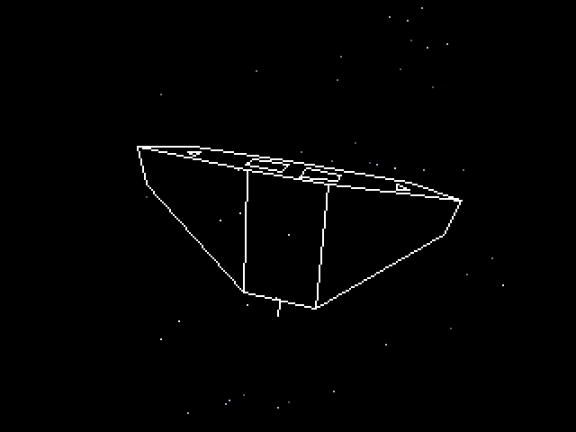

**COBRA read the other way round** ([D106](01-decisions.md)).
`demos/cobra2.act` is a copy of the compiled COBRA, which it leaves
alone: the ship does not turn, a camera circles it at a sixth of COBRA's
rates, and the ship flies straight along its length. The ship's frame
is then the world's, so the rotation COBRA computes is the camera's,
and everything fixed in the world goes through it -- the corners, 24
stars and 10 specks of dust.

**Elite's sky, placed in the world, and the ship flying through it.** A
star is a direction and swings across the screen exactly as far as the
camera turns. A speck is a point fixed in the world; the ship has a
place in the world and flies eight model units a frame along its nose,
the camera following, and a speck's place from the ship goes through
the perspective as a corner does -- so specks stream past the hull, and
those in front of it and behind it part company as the camera goes
round. As Elite does with its stardust, what leaves the screen is
recycled: a star across the opposite edge, a speck somewhere in view
ahead of the ship, each put back into the world through the matrix's
transpose. The ship moving and not the dust is the owner's call: it is
the shape a second ship will need.

**Behind the ship, the sky is hidden.** The ship is lines, so a star
behind it would show through its body. Its outline -- the edges where a
face turned to the camera meets one turned away -- is crossed twice by
any row, and a point between the two crossings of its row is not drawn:
a star always, a speck when it is behind the ship's centre. It stays in
the sky and comes out again past the ship's edge.

**Measured**: 90,065 of the frame's 139,583 clocks, 60 Hz over 1,800
frames -- the sky 36,456 (in assembly: the ship's own three rows once a
point, a table and a `MUL` for the perspective, and the outline test),
its dots 2,166, recycling 1,620; the transform skips the stern's panel
vertices while the stern is turned away. `test_cobra2` holds it to every claim COBRA is held to
and, on top, to `tools/mk3d.py`'s models of the sky: every star and
speck where the models put it, in its colour, and none drawn inside the
ship's outline; each page the dots with
the lines over them, pixel for pixel; over 120 frames the ship flying
its four units a frame, each star on the screen keeping its direction
and each speck its place in the world; and what is recycled mostly back
on the screen the next frame. Faces keep hysteresis on the way out only: at half COBRA's rates, the first cut's,
two-sided hysteresis left a one-frame gap between two faces trading an
edge. The PRG is 14,330 bytes.

### `KEYTEST` — what the keyboard sends

`demos/keytest.act`: every byte the PS/2 FIFO delivers, on the screen
as hex as it arrives and echoed to the serial port -- the raw Set 2
stream, a make code, `$F0` then the code for a release, `$E0` before
an extended key -- and under it what the library makes of the same
bytes: the keys `KeyHeld` says are down and the last one `KeyHit`
saw. Esc twice resets the machine. Written the day the space bar did nothing in
Ms. Cool-Man ([D101](01-decisions.md#d101--a-program-that-reads-the-keyboard-owns-it)):
the window typed a character as make-then-break in one burst, and
this shows that in one line, where a real press is a make, a pause,
then the break. The program to run first when a keyboard, a front end
or a board is in doubt; the serial log is the record.

### `MSCOOLMN` — Ms. Cool-Man: the arcade's first two mazes, in mode 2

`demos/mscoolman.act`, 56 KB of PRG from `$1400` under the loader of
[D102](01-decisions.md#d102--the-loader-a-program-owns-the-machine-and-never-comes-back),
the whole of Ms. Pac-Man with the arcade's rules: the four mazes on
the arcade's schedule -- pink for levels 1 and 2, light blue for 3 to
5, orange for 6 to 9, navy for 10 to 13, then the third and fourth
shapes again in magenta-and-yellow and in salmon, four levels each and
in turn for ever -- the four ghosts with their own targets, the pills,
the fruit, the house, the tunnels, the score beside the maze, the
ghost's score where it was eaten, and the three intermissions. A hobby port for the machine's owner, with no users; **its art
is the arcade's own pixels**, in the repository by that owner's
decision. `tools/mkmscool.py` rips the two mazes, her nine frames, the
ghosts', the fruit and the font from the sheet images in
`assets/misscool/` (The Spriters Resource's arcade Ms. Pac-Man and
Pac-Man sheets) and writes `assets/misscool/mscoolman_art.act` beside
them; `demos/mscoolman.parts` names that file as the part the game
compiles behind, `sim/harness.py`'s `act_sources()` reads the
manifest, and `poe check` holds the generated file to the sheets.
Without the part, `poe demos` leaves the game off the disc and says
so, and the gate skips, loudly.

**Mode 2, because the arcade board is a tile map with sprites.** The
maze is 28 × 31 tiles of 8 × 8 in the map at VRAM 0, a dot is a tile
and eating one is one map write; the screen holds 30 rows, so
`VID_SCY` is 4 and the generator rolls the outer walls four pixel
rows into the visible halves of their tiles -- the top wall shows in
lines 0-3, the bottom in 236-239, all 31 rows on 240 lines. The score,
high score, level, lives and level fruit sit beside the maze in
columns 28-39, where the arcade's 224-wide picture leaves 96 pixels
of a 320-wide screen: the arcade's HUD rows above and below the maze
are what the height does not allow, and the side is where it goes.
The font is the arcade's, the maze tiles and palette are the sheet's
(38 to 40 tiles a shape, five colours each; the fifth and sixth
mazes are the third and fourth shapes under other palettes, which the
generator proves by finding the nibble permutation and emits as
palettes alone), the lives and the fruit beside the maze are her
sprite and the fruit sprites undoubled into tiles, and a cell's kind
-- wall, path, dot, pill, door -- follows from its tile, the outside
having a black tile of its own so that it is not a path.

**A character is four hardware sprites.** Sixteen logical pixels over
a doubled mode is 32 raster lines, and a sprite is 16 × 16 raster, so
each of her, the four ghosts and the fruit is a 2 × 2 block -- 24 of
the 32 descriptors, all from palette bank 15, the one bank the engine
gives sprites (`SPR_CTRL[7:4]`). Her left-facing frames are the
right-facing ones H-flipped with the quadrants swapped; the ghosts'
eight frames are stored once with the body as colour index 1 and
written to VRAM four times at load with index 1 replaced by each
ghost's colour -- 16 KB of VRAM for 2 KB of program. The engine draws
eight sprites a line and trails every sprite two lines to clear its
span ([04-system.md §5.6](04-system.md)), so the seam between a
character's halves, where its top sprites' trailing lines meet its
bottom sprites' first, is where three characters abreast at exactly
one height cost more than a line has and the lowest-numbered loses
a line. The five movers therefore take the low descriptor numbers in
turn, a frame each, so a loss flickers between them instead of
sticking to one; Inky and Sue bob out of step with Pinky in the
house. Measured with `sim/mscool.py`'s autopilot eating its way round
the pink maze with `SPR_CTRL`'s overrun flag cleared every frame:
32 of 390 frames overran before a death, 75 before the rotation;
at level 3 with all four ghosts loose the gate's 240-frame stretch
has measured anywhere from 68 to 165, depending on where they are --
the count is printed, not gated, because a ghost train in a corridor
is the game and not a fault.

**The rules are the Pac-Man Dossier's**, which Ms. Pac-Man keeps:
speeds as sixteenths of a pixel a frame from the percentages of
1.25 px (her 80 %, ghosts 75 %, frightened 90 and 50, the tunnel 40,
by level band), the scatter/chase timetable (7, 20, 7, 20, 5, 20, 5
seconds at level 1, the sixth chase endless from level 2), Blinky at
her tile, Pinky four tiles ahead with the upward overflow (four left
as well), Inky's vector doubled from Blinky, Sue's eight-tile coward
radius, up-left-down-right on a tie, no reversing except when the
mode flips, the house counters (Inky at 30 dots, Sue at 60 more;
after a death 7, 17, 32; four seconds without a dot lets the next
out), Cruise Elroy at 20 and 10 dots, the fright lengths by level
with the flashing, 200-400-800-1600 for the ghosts on one pill, a
frame of freeze a dot and three for a pill, the eaten ghost's eyes
home through the door and out again. Ms. Pac-Man's own: the ghosts
wander at random through the first two scatters so no pattern works
twice, and the fruit walks in through a tunnel after 70 dots and
again after 170, wanders, and leaves by a tunnel -- cherry,
strawberry, orange, pretzel, apple, pear, banana by level, 100 to
5,000. The opening jingle plays under READY! at a game's start, as
the arcade's does: melody and bass on two voices from the VGMusic
transcription of the level intro (mspacman.mid, Oedipus, 106 bpm),
its pitches as the engine's 0.5 Hz steps and its lengths in frames.
**The intermissions** come after levels 2, 5, 9 and every fourth
after, on a black screen under the clapperboard from the sheet
clapping its number: "They Meet" and "The Chase" move as the
reference implementation whose maps these are (masonicGIT/pacman,
`src/cutscenes.js`) moves them, frame for frame at the arcade's own
pixel positions -- Pac-Man and Inky along one lane, she and Pinky
along another, the ghosts quickening at the middle; both in from the
sides, the ramp over the ghosts as they bump heads, the climb, and
the heart; then the four runs of the chase at two and a half and
three pixels a frame and the seven-pixel dart. "Junior" has no
reference to follow and is choreographed from its description: the
parents at the left, the stork over the top, the bundle dropped,
falling, bouncing twice, and Junior in it. Pac-Man's own frames are
on the sheet (left is right mirrored, down is up turned over), and so
are the heart, the stork, the bundle and Junior. "They Meet" plays
its tune, the VGMusic transcription (mspacman2.mid) on two voices;
**the tunes of "The Chase" and "Junior" have no transcription to be
found and are not made up**, so those two acts play to their sounds.
Not there: a second player, and the level-by-level fright and speed
tables past level 5 are the Dossier's for Pac-Man.

**The gate** (`sim/test_action.py`, on `sim/mscool.py`) runs the game
three ways: on the bare machine for the rules; `SYS`'d from a booted
BASIC with its interrupt handler running; and booted from the demos
disc by the real ROM, the launcher's `DRIVE 11` and `SYS "MSCOOLMN.BIN"`
typed at the keyboard, the space bar as a make-and-break burst, an
arrow key held -- the path a person takes, and the one that found
[D101](01-decisions.md#d101--a-program-that-reads-the-keyboard-owns-it)
twice. On the bare machine: the art file is what the generator writes; the compiled bytes agree with
`tools/cool8asm.py`'s; the title frame is mode 2 scrolled four lines
with the pink maze's own tile in the corner and her name in yellow;
READY!; 224 dots, three lives; she walks left along row 23 and each
dot is ten and a blank cell; Blinky and Pinky loose, Inky waiting;
the pill is fifty and six seconds of blue and the loose ghosts turn;
a blue ghost eaten is 200, eyes, the door, the house, out again; a
red one is a life and everyone back at the start with one icon fewer
beside the maze; the level cleared is the pink maze again, and again
is the blue one with 244 dots, its palette, its tiles and the orange
beside it; the fruit walks in after 70 dots; the sprite engine's
overrun flag over 240 frames of play; then the level poked to 2, 5, 9
and 13 in turn and cleared, and after each the clapperboard with its
digit, the first act's tune playing and the others' not, the next
level's READY!, and levels 6, 10 and 14 in the orange, the navy and
the magenta maze with their dot counts, palettes and tiles. An autopilot in `sim/mscool.py`
pokes her wanted direction each frame along a shortest path, and the
same file run by hand writes the frames as PNG: `python sim/mscool.py
pill` (or `title`, `death`, `clear`, `fruit`) -- which is how every
picture above was checked, and how the two bugs of the first frame
were found: every cell in row 0 because `row << 7` on a `BYTE` is a
byte, and the fruit one column off the sheet.

### `ARKANOID` — the arcade Arkanoid, all 33 rounds, in mode 2

`demos/arkanoid.act`, the whole of Taito's 1986 arcade Arkanoid under
the loader of [D102](01-decisions.md): the 32 rounds in the arcade's
layouts on their four backgrounds, the Vaus, the ball, the seven
capsules and what each does, the laser, the three balls, the enemies
through the gates in the frame's top, the exit a B opens, DOH on round
33, the intro's story over the mothership, and the board's own music. A
hobby port for the machine's owner, with no users; **its art is the
arcade's own pixels**, as Ms. Cool-Man's is. `tools/mkarkanoid.py` reads
The Spriters Resource's arcade sheets in `assets/arkanoid/` (the fields,
the blocks, the power-ups, the enemies, DOH, the intro's mothership and
the owner's fuller "Arkanoid (World, older)" Vaus sheet) and writes
three files there: `arkanoid_art.act`, which `demos/arkanoid.parts`
names as the part the game compiles behind, and **two data files the
game reads from its own drive** -- ARKANOID.DAT and ARKSCENE.DAT, 92 KB
of tiles and sprite patterns that do not fit the program and are
streamed from the flash into VRAM when a phase needs them
([D107](01-decisions.md)). `demos/arkanoid.disc` names them, and
`tools/mkdemos.py` puts them on drive 11 beside ARKANOID.PRG. `poe
check` holds all three to the sheets.

**The rounds are read off the arcade**, from StrategyWiki's walkthrough,
whose 32 pictures are the arcade's own 224 x 256 frames: each brick cell
by its face, 40 of its 65 inner pixels one brick colour and its right
and bottom edges the black every brick has. Round 1 reads silver, red,
yellow, blue, magenta, green. One cell is put back by hand: round 5's
top-left antenna, under a cone and its shadow in that frame. The same
frames that caught an enemy say which comes when: cones on the blue
rounds, pyramids on the green, molecules on the circuit, cubes on the
grey -- the background and the enemy are one choice, (round - 1) mod 4.

**Mode 2, the field at one pixel to one.** The arcade's field is 224 x
240 under its score line and mode 2 is 320 x 240, so the field is
columns 0-27 exactly and the score, the round and the lives go beside
it. A background is a model the generator proves against the sheet --
its frame, a pattern of cells, and the cells the pattern does not
predict. A brick is two tiles; its shadow, one cell right and one down,
is the background's dark tile, as the arcade's own tile map does it. The
gates open in the frame's top row a strip of six frames at a time; the
exit is three frames of crackle in the right wall.

**The Vaus is composed into the background** ([D107](01-decisions.md)):
the background under it, its shadow in black, the Vaus, into tiles --
all 60 of its frames, the lights turning, the enlarging and arming
morphs, its appearing and its breaking up -- so it costs no sprite and
its shadow is the arcade's. Everything else is sprites from one bank,
the capsule's two colours and the round's enemy's four filled in when
they change.

**The rules as far as they are known.** Points by colour, 50 to 120,
silver 50 times the round and two hits (one more every eight rounds),
gold never; 1,000 for a capsule, 100 for an enemy, 10,000 for the exit,
1,000 a hit on DOH, who takes sixteen; an extra Vaus at 20,000, 60,000
and every 60,000. The capsules as the arcade's instruction card names
them -- orange S slows the ball, green C catches it, blue E enlarges,
aqua D splits it in three, red L arms the laser, pink B opens the exit,
grey P is a Vaus more -- one at a time, none while three balls fly, B
and P half as likely as the rest, never the power already held. **Chosen,
because the arcade's numbers are not published**: eight ball speeds from
1.5 to 3.5 pixels a frame, a step faster every eight hits and at the
first touch of the ceiling; six angles off the Vaus, 30, 45 and 60
degrees either way by where the ball lands; a capsule a brick in five;
an enemy through the gate on the Vaus's side every six seconds, three at
most, wandering down; DOH opening his mouth every two and a half seconds
for three shots aimed where the Vaus was. **The sound effects are made
on the voices** -- the rip has the board's music and nothing else --
and are this port's. **The music is the board's**: the story, the round
start, DOH's round, game over and the ending, replayed from the YM2149's
register log a 60 Hz frame at a time, the three channels' periods as
phase increments and their levels on the machine's linear scale, the
envelopes worked out where a channel asks for one.

**DOH** sits in the wall's hole on his red round, cells 10-17 x 5-16,
drawn from four normal frames with his mouth opening; hit, he flashes
cyan, and beaten he turns purple in the sheet's twelve dying frames --
each a normal frame with one colour changed, a palette write -- then
his wireframe comes down through him a cell row at a time, where the
sheet's eight frames of it pixel by pixel would be 660 tiles. **Not
there**: the ending's words, of which no frame was found; the board's
extra-life jingle, which the rip does not have.

**The intro and the title are the arcade's pictures**: the ARKANOID
logo over the title screen's words, and the story typed over the
mothership, which is lit, hit in four red flashes -- palettes over its
lit frame -- and gives up the Vaus in rings, the Vaus flying off in the
sheet's fifteen frames. The story's words are the game's (the NES
version's FAQ quotes them; StrategyWiki's frame shows the last three
lines); the other lines' breaks and the timing are this port's, and the
font here has no comma. The glyphs themselves are the arcade's where a
frame shows them: 25 on the title and the play screen, 23 of them the
Namco font Ms. Cool-Man has and E and L a pixel wider; the rest are
Namco's, and `tools/mkarkanoid.py` lists which.

**The gate** (`sim/test_action.py`, on `sim/arkanoid.py`) runs the game
with its two data files on drive 11 of a flash image of its own: the
generator's three files current; the compiled bytes the same as
`tools/cool8asm.py`'s; mode 2 and the logo on the title; round 1's
silver and green bricks where the arcade has them and a shadow cell the
dark tile; ROUND over the field and the round-start tune on voice 0; the
Vaus as cells of the background in its banks, its shadow in the row
under; 600 frames of the autopilot with a frame of play in every
vblank; each capsule caught and its power; an enemy through a gate; out
through the exit into round 2 with 10,000; a ball lost and a life gone;
the stack where it should be; then the path a person takes -- the real
ROM booting the demos disc, `DRIVE 11` and `SYS "ARKANOID.BIN"` typed at
the keyboard, the game finding its two data files on the drive it came
from, the logo up, space, and round 1 -- with the disc first held to
this build and these data files; then round 33, DOH's face in pattern
bank 2, the sixteenth hit, and the black he sat in. `python sim/arkanoid.py
play` (or `powers`, `enemies`, `doh`, `intro`, `profile`) plays it with
an autopilot and writes the frames as PNG.

### `SLIDES` — the old test pictures, as fully as mode 6 can show them

`demos/slides.act`, on drive 11, reading drive 10: every `.PIC` there in
catalogue order, the space bar for the next, round again after the last,
Esc to reset the machine. The pictures are image processing's old test
set -- the USC-SIPI Mandrill and Peppers, Kodak's parrots (`kodim23`) and
painted face (`kodim15`) -- which `python tools/mkpics.py --fetch`
downloads and converts. **They are not in the repository**, and neither
is a screenshot of them ([D103](01-decisions.md);
[`assets/pictures/README.md`](../assets/pictures/README.md) says why,
and why Lena is not among them).

**Mode 6 is the machine at its most colourful**: 256 × 240, a byte a
pixel, all 256 palette entries on the screen at once, each any of 4,096.
Each picture brings its own 256 -- the machine's frame shows 256, 254,
254 and 252 different colours for the four, the black border included
-- chosen by libimagequant among the
4,096 the palette holds, dithered against exactly those, and cropped to
the screen's 16:15 about the centre.

**The file is the hardware's own bytes**: `PIC`, a version, the mode,
the border's palette index and two reserved, then 512 bytes of palette
in the form `PAL_DATA` takes, then 61,440 pixels as VRAM holds them --
61,960 bytes. `tools/mkpics.py`'s docstring is the layout; `pack` and
`unpack` there are its one implementation on the host. **Version 2 adds
a second file**, `NAME.RPL`: row by row, the entries to rewrite -- two
slots written in the blanking before a row, then up to fourteen for the
row after, written while the row is drawn
([D104](01-decisions.md)). A picture and its list are under 74 KB, so
the drive holds six.

**Showing one is two streams and two vertical blanks.** The header and
the palette come into memory, 33,832 clocks through `FlashRead`; at the
next frame the palette goes black -- 3,603 clocks, inside the blank's
11,970, so the old picture goes all at once; the pixels stream from
`FLS_DATA` to `VRAM_DATA` in an `ASM` loop; at the next frame the new
palette goes in, 5,669 clocks, so the new picture arrives whole.
Measured on the machine, from `Show` to the next key poll: 2,370,373
clocks, 283 ms -- 2,089,180 of them the stream, **34 clocks a byte,
which is the flash's own rate and not the loop's**, and 237,804 three
frame waits. The loop itself is 14 clocks a byte, and `FLS_DATA` holds
every read off until the shifter has the next byte
([04-system.md §4.8](04-system.md)).

**This paragraph said 149 ms, and the machine was wrong.** It then
handed `FLS_DATA` over at once, so the stream measured 14 clocks a byte;
the documents said the flash delivered one in 16; and the RTL's shifter
takes 34, which `sim/tb/cool8_flash_tb.v` now measures and the machine
now models. SLIDES was the first program fast enough for the
difference to show: every earlier reader of the flash was a compiled
loop slower than the wire.

**The compiled version was measured first, and failed its own gate.** A
`FOR` over the palette took 53 clocks a byte -- 27,201 for the 512, more
than twice the blank -- and the gate reported the top 57 lines of a
frame drawn under a palette half written. The pixel `WHILE` took 37
clocks a byte, 92 % of a picture's time. Both loops are assembly now,
and they took SLIDES from 4,791 bytes to 4,711; turning the cursor off
put it at 4,719.

**The cursor was on over the first version's pictures, and no gate saw
it.** The text cursor is its own overlay, drawn in every mode, and BASIC
leaves it on through `SYS` and the loader, so it blinked in the middle
of the Mandrill -- where the owner saw it. The gate's bare machine has
the cursor off from reset, so it could not: it now turns the cursor on
in mid-screen first, as BASIC leaves it, and looks at the frame again
half a blink later.

**The screen found the waste in the palette.** The first conversion
counted palette indices -- 254, 252, 255 and 201 -- while the frame
showed 242, 227, 232 and 163 different colours: libimagequant places
its colours at full precision and posterises after, so neighbours
round onto one 12-bit colour, and the painted face threw away 93 of
its 256. `mkpics.py` now gives the distinct ones back to it as fixed
colours and lets it place the freed slots again, until all differ or a
pass frees none.

**And more than 256 colours: the palette changes between rows**
([D104](01-decisions.md)). The four pictures are version 2: every row
is drawn in a palette of its own, up to sixteen entries from the row
above's -- two rewritten in the blanking before the row, to entries the
row above used, and up to fourteen while the row above is drawn, to
entries it does not use. `Raster()` does it every frame, locked to
`VID_RASTER`, after `Commit` has put row 0's palette back in the blank.
**The machine's frame shows 822, 523, 628 and 446 different colours**
for the Mandrill, the Peppers, the parrots and the painted face, where
one palette showed 256, 254, 254 and 252, and each sits 22 to 48 %
closer to its original once both are blurred as the eye blurs
dithering. SLIDES is 5,525 bytes with it.

**Finding it cost a compiler bug.** Every version-2 picture was refused
at first: `LoadRpl` builds its change list's name with `rpl_name(i + 1)
= pic_stem(k * 8 + i)`, and a store into a byte array at a computed
byte index popped its value over its index, so the stem went 82 bytes
past the array and the catalogue was searched for a blank name. The
compiler is fixed ([15-action.md §3](15-action.md)), `test_features`
holds the shape, and every other program on the disc compiled
byte-for-byte the same with the fix -- none had used it.

**Gate-enforced** (`test_slides` in `sim/test_action.py`). On a flash
image of its own -- two made-up pictures, with a text file, a `.PIC`
too short to be one, a `.PIC` of an unknown version, a version-2 `.PIC`
with no change list, and a made-up version-2 picture whose rows each
bring three entries and recolour two: the first picture's pixels in
VRAM from `VID_BASE`, its 256 entries committed and its border; every
raster pixel of a frame the picture's or the border's; the palette black
and back each inside a blank; a space skipping the bad file to the
second; the next skipping the list-less picture to the made-up raster
one, its frame every row through its own palette, pixel for pixel, and
**the machine's log of every palette write held to
[04-system.md §5.9](04-system.md)** -- of 2,906 writes in two frames,
none lands under a pixel showing its entry, and the blanking writes land
33 to 61 clocks after `VID_RASTER` names their line, where 70 is the
last that beats its first pixel; round again to the first; and an empty
drive saying so on the text screen. Then, once `poe demos` has put the
real pictures on the disc, the path a person takes: the ROM booting it,
`DRIVE 11`, `SYS "SLIDES.BIN"`, all four in turn -- each exact against
its own rows' palettes, its log clean -- and round again. `python
sim/test_action.py --slides` writes each picture as the machine shows
it to `sim/build/slides_<name>.png`.

**Adding a picture** is an entry in `SOURCES` -- the file, where it came
from, its SHA-256 -- then `--fetch` and `poe demos`. SLIDES reads the
catalogue, not a list of names, so any version-1 `.PIC` on drive 10 is
a slide.

### `HHGG`, `ZORK1`, `PLANET`, `LGOP` — Infocom Text Adventure Suite (Native Z3 Interpreter)

Infocom's celebrated interactive fiction text adventure games, running natively on COOL8's pure assembly Z-Machine Version 3 (Z3) interpreter on Drive 13 (`DEMOS`) and Drive 14 (`ADVENTUR`):

1. **`HHGG` (Drive 13)**: *The Hitchhiker's Guide to the Galaxy* (1984) by Douglas Adams and Steve Meretzky. Styled with the authentic Amiga dark blue background, crisp white letters, inverted status bar, and matching blue border (`CATTR = $1F`, status `$F1`, border `$01`).
2. **`ZORK1` (Drive 14)**: *Zork I: The Great Underground Empire* (1980) by Marc Blank and Dave Lebling. Styled with classic amber phosphor letters on a deep black background (`CATTR = $0E`, status `$E0`, border `$00`).
3. **`PLANET` (Drive 14)**: *Planetfall* (1983) by Steve Meretzky. Styled in standard crisp monochrome text on black (`CATTR = $07`, status `$70`, border `$00`).
4. **`LGOP` (Drive 14)**: *Leather Goddesses of Phobos* (1986) by Steve Meretzky. Styled with a dark gray background and very light gray foreground text (`CATTR = $87`, status `$78`, border `$08`).

**Architecture and execution**:
- Launched via `SYS "<NAME>.BIN"` from their respective `.BAS` loader programs on Drive 13/14.
- **Interpreter footprint**: 7.5 KB at `$0200..$1F73`.
- **Story file storage**: Stored as `.DAT` chunks on Drives 13 and 14 (up to 128 KB per story).
- **Demand-paging memory**: 16-page LRU cache (512 bytes/page = 8 KB RAM window) backed by SPI Flash paging.
- **Visuals & I/O**:
  - Full 80×30 text mode (`MODE 0`) with automatic word wrapping.
  - Real-time inverse video status bar on Row 0 showing room location, score, and move counter.
  - Interrupt-driven keyboard input with line editing, word tokenization, and 16-bit binary search across Infocom vocabulary dictionaries.

### UCSD Pascal p-System II.0 (`PASCAL`)

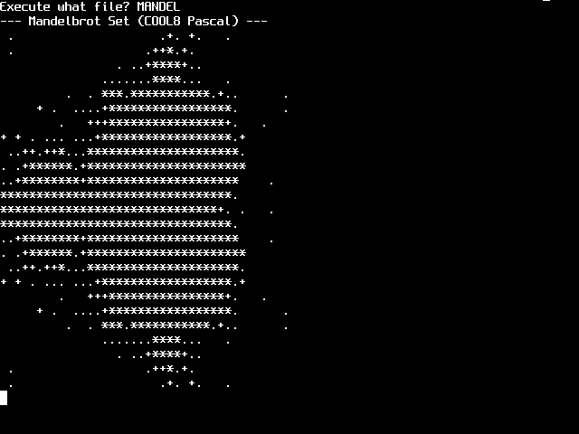

A complete, native port of the UCSD Pascal p-System II.0 virtual machine (P-Machine), running the authentic 1979 operating system, compiler, filer, and editor directly on COOL8.

- **Interpreter footprint**: 8.6 KB native machine code at `$0200..$247A`.
- **Operating system volume**: Packaged as standard UCSD disk volume on Drive 15 (`SYSTEM.PASCAL`, `SYSTEM.FILER`, `SYSTEM.COMPILER`, `SYSTEM.EDITOR`, `SYSTEM.MISCINFO`, `SYSTEM.SYNTAX`, and example programs `HELLO`, `SIEVE`, `HANOI`, `MANDEL`, `GUESS`, `FACT`).
- **Interactive Console & Terminal**: Emulates VT-52 terminal protocol with cursor home (`$19`), erase-to-end-of-screen (`$0B`), erase-to-end-of-line (`$1D`), cursor-up (`$1F`), and gotoxy (`$1E`), driving the native 80×32 text hardware directly.
- **Execution**:
  - Launched from BASIC via `RUN "PASCAL"` (or `SYS "PASCAL.BIN"`).
  - Boots through Segment 4 (`INITIALIZE`), loads `SYSTEM.MISCINFO`, mounts volumes, and drops into the root command line prompt:
    `Command: E(dit, R(un, F(ile, C(omp, L(ink, X(ecute, A(ssem, D(ebug,? [II.0]`
  - Supports interactive command menu navigation and execution of native Pascal tools.

## 5. Adding one

1. Write `demos/name.bas`. Keep it BASIC, keep it under 80 characters a
   line (the editor's logical line), and say in a `REM` what it is and
   where it came from.
2. `poe demos` — every demo is typed in, saved, run and shot.
3. Look at the picture. `docs/img/demo-<name>.png`.
4. Add a section here saying what it demonstrates about *this* machine,
   not just what it draws.

**A CoolAction! one** is `demos/name.act`, and `poe demos` compiles it
behind the library at `$1400` as `NAME.PRG` on drive 11, with
`NAME.BIN` beside it -- the loader of
[D102](01-decisions.md#d102--the-loader-a-program-owns-the-machine-and-never-comes-back),
which `SYS "NAME.BIN"` runs and which then owns the machine and
streams the program in over whatever BASIC was. Up to 60 KB, no
return: a program that finishes resets the machine. Nothing else to
do. Its gate is in `sim/test_action.py`, not here: a port of a BASIC
demo is held to the BASIC one's framebuffer, and a new one to whatever
it claims. A stub is not wanted and not listed. Data the repository
must not hold -- Ms. Cool-Man's ripped art -- goes in a file a
`demos/name.parts` manifest names (one path a line, `#` comments),
compiled between the library and the program; a missing part leaves
the program off the disc with a message rather than a compile error.

**A Software one** — a machine-code system — is a `.BIN` on drive 14
and a `demos/name.bas` stub that sets `DRIVE 14` and `SYS`es it; add
the stub's name to `SOFTWARE` in `tools/mkdemos.py`, which is the one
list that says a `.bas` in `demos/` is a stub and not a demo.
